# ConversationMonitor state machine

`ConversationMonitor` decides *whether* and *when* the familiar
speaks. Per-channel state, three triggers, one evaluation path. The
`interjection channel=… trigger=… decision=YES|NO` log line is the
externally observable transition.

Module: `src/familiar_connect/chattiness.py`.

## States and triggers

```mermaid
stateDiagram-v2
    [*] --> Idle : channel subscribed

    Idle --> Buffering : on_message appends to ChannelBuffer

    Buffering --> EvalDirectAddress : is_direct_address(text) == True<br/>(name / alias / @mention)
    Buffering --> EvalInterjection : message_counter >= next_interjection_at
    Buffering --> LullPending : text path, neither above<br/>(call_later(lull_timeout, …))
    Buffering --> EvalLull : voice path, is_lull_endpoint=True

    LullPending --> Buffering : new message arrives<br/>(timer cancelled)
    LullPending --> EvalLull : timer expires

    EvalDirectAddress --> Firing : decision=YES
    EvalDirectAddress --> Resetting : decision=NO<br/>(buffer always resets on direct address)

    EvalInterjection --> Firing : decision=YES
    EvalInterjection --> Buffering : decision=NO<br/>check_count++; next_interjection_at advances<br/>(floor 3)

    EvalLull --> Firing : decision=YES
    EvalLull --> Buffering : decision=NO (no reset)

    Firing --> Resetting : snapshot buffer → on_respond callback
    Resetting --> Idle : clear buffer, counters, lull timer

    Idle --> [*] : clear_channel(channel_id)
```

## Transition rules

| From | To | Condition | Side effects |
|------|----|-----------|--------------|
| `Idle` / `Buffering` | `Buffering` | `on_message` | append `BufferedMessage`; `message_counter++`; cancel lull timer |
| `Buffering` | `EvalDirectAddress` | name / alias / `<@id>` matches | acquire `buf.lock` |
| `Buffering` | `EvalInterjection` | `message_counter >= next_interjection_at` | acquire `buf.lock` |
| `Buffering` | `LullPending` | text path, neither above | `loop.call_later(lull_timeout, _schedule_lull_evaluation)` |
| `LullPending` | `Buffering` | next `on_message` arrives | `_cancel_lull_timer` |
| `LullPending` | `EvalLull` | timer expires | schedule async task, `buf.lock` |
| any `Eval*` | `Firing` | `_evaluate` returns `YES` | call `_fire_respond` |
| `EvalInterjection` | `Buffering` (NO) | LLM says NO | `check_count++`; `next_interjection_at += _interjection_interval(tier, check_count)` (floor 3 from `starting_interval - 3·n`) |
| `EvalDirectAddress` | `Resetting` (NO) | LLM says NO | `_reset_buffer` regardless — direct address always clears |
| `Firing` | `Resetting` | — | `snapshot = list(buf.buffer)`; `_reset_buffer`; `await on_respond(channel_id, snapshot, trigger)` |

## Lock discipline

- `buf.lock` is an `asyncio.Lock`, one per channel.
- Held during `_evaluate` + `_fire_respond` so only one evaluation
  runs at a time per channel.
- **Not** held during the main reply LLM call or pipeline assembly —
  those live downstream of the `on_respond` callback.
- New messages arriving during an `Eval*` state queue up in the
  buffer lock-free; the current evaluator sees a snapshot, subsequent
  messages are evaluated next cycle.

## Step-down interjection curve

`_interjection_interval(tier, check_count)` returns
`max(3, tier.starting_interval - check_count * 3)`. Each declined
interjection shrinks the distance to the next check by 3, flooring
at 3. After a successful interjection or direct address, state is
reset and the curve starts over from `starting_interval`.

## Evaluation prompt inputs

`_evaluate` builds a two-message prompt (system + user) for the
interjection-decision LLM. The user message contains:

| Field | Source | Notes |
|-------|--------|-------|
| `familiar_name` | constructor arg | static per familiar |
| `character_card` | `memory/self/*.md` files | pre-loaded at construction |
| `chattiness` | config personality string | static per familiar |
| `recent_history` | `HistoryStore.recent(limit=5)` | 5 most recent turns for the channel; empty string if none |
| `buffer` | `ChannelBuffer.buffer` | unpersisted messages since last response |

Three templates select the closing question:
`_LULL_PROMPT`, `_DIRECT_ADDRESS_PROMPT`, `_INTERJECTION_PROMPT`
(the interjection variant also includes `message_count`).

## Triggers and `is_unsolicited`

`ResponseTrigger` (`chattiness.py:33–47`) has three values. The
voice path uses `trigger.is_unsolicited` (true only for `interjection`)
to bias the interruption-tolerance RNG toward pushing through barge-in
remarks. Lulls follow the base tolerance + mood modifier without the
unsolicited bias.

## Follow-up: mid-response re-evaluation

Today `_fire_respond` snapshots and freezes. Messages arriving while
`Firing → Resetting → Idle → Buffering` unwinds and the main
`main_prose` LLM call completes will land in the new buffer and be
evaluated next turn. A follow-up roadmap item generalises the voice
path's `generation_task` / `interruption_detector` pattern (see
[interruption flow](interruption.md)) to the text path so mid-response
messages can re-plan or cancel the in-flight reply. See
[conversation-flow](conversation-flow.md) for the target behaviour.
