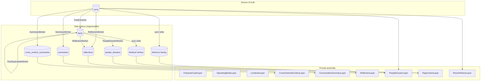

# Context pipeline

How a user turn becomes a system prompt, and how side-indices stay in
sync with the raw source of truth.

## Source of truth vs side-indices

The `turns` table in `data/familiars/<id>/history.db` (Turso) is the
durable, append-only source of truth. Every derived artifact —
summaries, cross-channel briefings, FTS indexes (sibling `fts/turns/`
and `fts/facts/` tantivy dirs on disk) — is **regenerable from
`turns` alone**. Deleting any side-index row (or the whole table) is
safe; the next worker tick rebuilds it. Tantivy indexes auto-rebuild
on `HistoryStore.__init__` when missing.



## Layers

Each layer implements a narrow Protocol:

```python
class Layer(Protocol):
    name: str

    async def build(self, ctx: AssemblyContext) -> str: ...
    def invalidation_key(self, ctx: AssemblyContext) -> str: ...
```

`build` returns the layer's text contribution (empty string opts out).
`Assembler` memoises `build` results keyed on
`(layer.name, invalidation_key)`. Two `assemble` calls with the same
context re-run `build` only for layers whose key changed.

### Static, file-sourced

| Layer | Source | Invalidation |
|---|---|---|
| `CharacterCardLayer` | `data/familiars/<id>/character.md` (persona plus operational essentials — `<silent>` token, first-person, conciseness) | BLAKE2b content hash — catches sub-second edits |
| `OperatingModeLayer` | in-memory `modes` dict, keyed on `viewer_mode` | `viewer_mode` |
| `LorebookLayer` | `data/familiars/<id>/lorebook.toml` (optional) | file content hash + matched entry indices |

### Dynamic

| Layer | Source | Invalidation |
|---|---|---|
| `ConversationSummaryLayer` | `summaries` table — the single per-familiar focus-stream row at `FOCUS_STREAM_CHANNEL_ID` (`ctx.channel_id` ignored) | `focus:<last_consumed_at>:<last_summarised_id>` |
| `CrossChannelContextLayer` | **retired** — `build` always returns `""` (attentional stream replaced it; see [below](#attentional-stream)) | unchanged (still keyed; never rendered) |
| `PeopleDossierLayer` | `people_dossiers` table, candidate set from recent authors + `turn_mentions`, plus the always-present `self:<id>` subject | `t<latest_id>:cap<n>:<key>:f<last_fact_id>` concatenated |
| `ReflectionLayer` | `reflections` table, channel-scoped (channel-agnostic rows always surface) | `ch<id>:r<latest_reflection_id>:cap<n>` |
| `RagContextLayer` | `fts/turns/` + `fts/facts/` tantivy search | `(current_cue, latest_fts_id, latest_fact_id)` |
| `RecentHistoryLayer` | `turns.recent_cross_channel(window_size)` — all **consumed** turns across all channels, ordered by `arrived_at, id` | not cached — it *is* the query |

The `recent_history` layer does not contribute to the system prompt.
It populates `AssembledPrompt.recent_history`, which the responder
appends as `Message` objects.

`recent_messages` calls `recent_cross_channel(familiar_id,
window_size)` — the last `window_size` **consumed** turns across
*every* channel, ordered by `arrived_at, id`. This is the read half
of the attentional stream (see [below](#attentional-stream)): a focus
shift consumes the target channel's staged backlog, so its messages
interleave into one cross-channel transcript instead of living in a
separate per-channel summary. Each user turn renders with a
`[HH:MM speaker #channel_id]` prefix — the `#channel_id` disambiguates
which channel a line came from once multiple channels share the
window.

Past `tool` turns (e.g. `view_image` results) are **folded into
user-side narration text**, not replayed as protocol `tool`
messages. Recent-history replay carries no tool-call linkage, so a bare
`role=tool` message would orphan — no preceding matching `tool_use` —
which upstream providers (Anthropic) reject with HTTP 500. Rendering as
`[tool result] …` text preserves the context without the invalid
protocol shape.

The narration uses `role=user`, **not** `role=assistant`: an
assistant-side replay teaches the model to open fresh replies with the
`[tool result] …` prefix (and even fabricate tool results inline) by
mimicking its own apparent past output — the same mimicry trap the
`[#id]` message-id tag avoids by being dropped from assistant turns.

## Watermark-driven workers

### `SummaryWorker`

Background task on `tick_interval_s` (default 5s). Per tick:

1. **Focus-stream rolling summary** — one per-familiar summary of the
   **consumed cross-channel stream** (the conversation the familiar
   actually attended to), stored in `summaries` under
   `FOCUS_STREAM_CHANNEL_ID`. Fetch consumed turns past the composite
   `(consumed_at, id)` watermark via `consumed_turns_after`; if
   `>= turns_threshold` (default 10) accumulated, build a prompt with
   `(prior summary, new turns)`, call `LLMClient.chat`, write back with
   the new watermark. Watermarking on `consumed_at` — not `id` — is
   load-bearing: a focus shift promotes a dormant channel's staged
   backlog with an **old `id`** but a **fresh `consumed_at`**
   (`promote_staged_turns` sets it to now), so an id cursor would skip
   it forever. First run is bounded by `backfill_cap` (default 200)
   then compounds forward. This tiles with `RecentHistoryLayer`: both
   describe the same consumed attentional thread (summary = older turns,
   recent history = the tail).
2. **Cross-channel summary** — for each `(viewer_channel, source)`
   pair in `cross_channel_map`, compare `source.latest_id` to
   `cross_context_summaries.source_last_id`. If the gap is `>= cross_k`
   (default 5), build a briefing-style prompt with
   `(prior summary, new turns in source)` and write to
   `cross_context_summaries`.

Both strategies compound: new summaries build on prior ones rather
than recomputing from raw turns each time. Bounds token cost. A
periodic full recompute (every *M* compounding cycles) is reserved
for later refinement once drift data demands it.

### Tantivy FTS indexes

Two on-disk tantivy indexes — `fts/turns/` and `fts/facts/` under the
familiar root — sit beside the Turso DB. They live outside the
database because pyturso wheels don't ship Turso's own FTS module yet,
and because tantivy queries outside Turso don't queue behind SQL
writes (the original "FTS5 blocks the Discord heartbeat" bug was a
single slow tokeniser query gating every other DB call).

Updates are synchronous from `HistoryStore`:

- `append_turn` writes the row to Turso, commits, then upserts the
  `(id, content)` doc into `fts/turns/`.
- `append_fact` does the same against `fts/facts/`.
- `update_turn_content_by_message_id` re-adds the row (tantivy treats
  same-id `add` as upsert).

Supersession isn't surfaced through the index — facts keep their docs,
and the SQL validity filter
(`superseded_at IS NULL AND (valid_to IS NULL OR valid_to > now)`)
strips retired rows after the FTS join. See
[Fact discipline](#fact-discipline-supersession-and-self-capability)
below.

`HistoryStore.rebuild_fts()` drops and repopulates the turns index
from `turns`. Run it after deleting `fts/` (or whenever tantivy drifts
from the relational tables).

### `FactExtractor`

Watermark-driven off `memory_writer_watermark`. Every `tick_interval_s`
(default 15 s), `turns_since_watermark(limit=batch_size)` returns up
to `batch_size` un-processed turns; if fewer than `batch_size` are
available, the tick is a no-op. Otherwise a single LLM call extracts
a JSON list of `{text, source_turn_ids}` facts, persisted with
provenance pointing back to the originating turn ids. The watermark
advances to the last processed turn id **whether or not** extraction
produced facts — otherwise a malformed response would stall the
worker on the same batch forever.

A post-extraction filter drops self-capability "facts" (e.g.,
`I cannot remember names`, `the assistant has no internet access`)
before they hit the store. See
[Fact discipline](#fact-discipline-supersession-and-self-capability)
for the rationale.

### `FactSupersedeWorker`

Retires prior facts replaced by newer ones about the same subject.
Watermark-driven off `facts.id`. Ticks every `tick_interval_s`
(default 60 s) — much slower than `FactExtractor` since supersession
isn't latency-critical and adds one LLM call per new fact.

Per tick:

1. `recent_facts(familiar_id, include_superseded=False)` returns up to `batch_size` (default 5) current facts. Facts newer than the internal watermark are evaluated oldest-first.
2. For each new fact, for each subject, pull prior current facts for that subject (capped at `priors_max`, default 20). Ask the LLM which priors the new fact contradicts or directly replaces.
3. Call `supersede(obsolete_facts=retired_ids, new_fact=<the new fact>)` to repoint each retired prior at the new fact (existing-id form mints nothing). Already-superseded priors (retired by an earlier subject this tick) land in the result's `skipped` rather than raising.
4. Advance the watermark to the highest fact id seen this tick — even on bad LLM output, preventing a loop on a fact the model can't parse.

Facts without subjects are skipped (`FactExtractor` must resolve at
least one `canonical_key` for a fact to be eligible). Logs one line
per tick only on retirements:
`[Supersede] evaluated=<n> retired=<n> watermark=<id>`.

### `PeopleDossierWorker`

Compounds per-person summaries off the facts watermark. Same shape as
`SummaryWorker` (compound prior + new evidence with one LLM call) but
keyed by `canonical_key` instead of `channel_id`. Cadence is
intentionally a quarter of `SummaryWorker`'s tick
(`tick_interval_s = 20 s`): people-level evidence churns slower than
turn-by-turn summaries, and the read path (`PeopleDossierLayer`) is a
cheap SQLite lookup that doesn't wait on the worker.

Per tick:

1. `subjects_with_facts(familiar_id)` returns
   `{canonical_key: max(facts.id)}` across non-superseded facts whose
   `subjects_json` lists each key.
2. For each subject, compare against its `people_dossiers.last_fact_id`
   watermark. Skip when nothing is new.
3. `facts_for_subject(canonical_key, min_id_exclusive=watermark)`
   pulls new evidence; the worker feeds prior dossier + new facts to
   the LLM and writes the result back with the updated watermark.

Empty LLM replies are dropped — a blank response must not blow away an
existing dossier. Subjects whose only facts are superseded drop from
the candidate set; the dossier row stays put.

### `ReflectionWorker`

Writes higher-order syntheses over recent turns + facts (M3). Ticks
every `tick_interval_s` (default 60 s) — slower than
`PeopleDossierWorker` because reflections capture themes and patterns,
not turn-by-turn updates.

Per tick:

1. Read `latest_id(turns)` for the familiar; compare to the newest
   reflection row's `last_turn_id` watermark. Skip if the gap is
   `< turns_threshold` (default 20).
2. Pull turns since the watermark plus the most recent N facts, so
   the reflection can cite evidence even when the turns themselves
   don't surface it.
3. Ask the background-tier LLM for at most `max_reflections_per_tick`
   (default 3) reflections, each with `cited_turn_ids` /
   `cited_fact_ids`.
4. Persist rows that cite at least one valid id; drop rows that
   hallucinate everything. The row's `last_turn_id` / `last_fact_id`
   columns snapshot the worker's view at write time and serve as the
   next tick's watermark — no separate watermark table.

`ReflectionLayer` reads recent rows on assemble and renders citation
breadcrumbs `[T#42, F#7]`. Rows citing at least one superseded fact
are flagged `(stale)`; the row is never deleted.

## Fact discipline: supersession and self-capability

The facts store holds **observations about the world**, with
provenance back to the source turns. Two policies keep it from
silently rotting:

### No self-capability statements

A "fact" like *the assistant cannot remember names or faces* is a
self-description, not an observation — it expires the instant the
underlying capability changes (e.g., once entity resolution lands).
Such statements belong in the system prompt or a runtime-computed
self-description, not in a persistent facts table where they'd
silently mislead the model long after they stopped being true.

`FactExtractor` handles this in two layers:

1. **Prompt-side**: the extractor's system message explicitly
   instructs the LLM not to emit facts about itself, the assistant,
   or its own limitations.
2. **Post-filter**: `_is_self_capability(text)` matches a small set of
   first-person and "the assistant/AI/model" patterns at the start of
   the fact. Matched facts are dropped (logged at DEBUG) before
   `append_fact`. Belt-and-braces — even if the model ignores the
   prompt, the row never lands.

The capability ban is **narrow**: it drops *capabilities/limitations*,
not the familiar's *narrative*. The familiar's own bits/performances,
choices, and relational stances/feelings get a home — the
[self-dossier](#self-dossier) — keyed to a reserved `self:<familiar_id>`
subject instead of poisoning whichever person the bit was about. The
distinction the extractor is taught: *capabilities/limits → dropped;
narrative/feelings/choices → self-subject*.

### Supersession instead of overwrite

For facts that legitimately go stale (job changes, shifting
preferences, emerging contradictions): replace the old fact with a
new one and mark the old row `superseded_at = now`,
`superseded_by = <new_id>`. The old row stays in the table.

- `recent_facts` and `search_facts` default to `WHERE superseded_at
  IS NULL` — reads see "what's currently true".
- Pass `include_superseded=True` for audit, contradiction
  inspection, or future provenance UIs.
- `supersede(obsolete_facts, new_fact)` is the unified write API
  (alongside `append_fact`). It retires (`new_fact=None`), repoints
  obsolete rows at an existing fact (a `Fact`/id, mints nothing), or
  atomically mints and points a merge (`new_fact` a `FactDraft`). It
  returns a `SupersedeResult` whose `skipped` records any obsolete row
  already superseded by a concurrent writer — a tolerated skip, not a
  raise.

The `fts_facts` index covers all rows including superseded ones (the
FTS triggers don't filter); read paths apply the
`superseded_at IS NULL` filter via the JOIN to `facts`. Keeping
superseded text indexed means re-superseding (e.g., reverting an
incorrect supersession via a new fact) doesn't require an FTS rebuild.

Cache invalidation: `latest_fact_id` counts all rows including
superseded ones, so the `RagContextLayer` cache key flips whenever a
new fact is appended — and supersession-by-replacement always
appends, so the key naturally moves. (A future "manual supersede
without replacement" path would need to track supersession state in
the key directly; not built today.)

### Subject metadata: surviving nickname rot

Display names appear verbatim in fact text ("Cass likes pho"), but
Discord and Twitch users can rebrand freely. Without an out-of-band
link to a stable identifier, every fact about a renamed user becomes
referentially orphaned — FTS keeps matching the stale name, and the
model has no way to know the new nickname is the same person.

The fix is a soft annotation on each fact: an optional `subjects_json`
column storing `[{canonical_key, display_at_write}]` for each person
the extractor identified. `Author.canonical_key` (`platform:user_id`)
is stable across renames; `display_at_write` is the name the LLM saw
when the fact was authored.

**Write path.** `FactExtractor` builds a participants manifest
(`canonical_key → current display name`) from two sources, batch-first:
authors of the current batch (with per-turn `guild_id` for label
resolution), then `recent_distinct_authors` per channel touched by the
batch — capped at `participants_max` (default 30). Widening matters
because a batch where only one user speaks otherwise forecloses on
linking other names in the turn text; including recent prior speakers
lets the LLM resolve "what about Aria?" to her canonical key even when
she didn't speak in this batch. Cap keeps prompt size bounded.

The manifest is injected into the LLM prompt alongside the turns. The
LLM is asked to optionally tag each fact with `subject_keys` — a list
of canonical keys from the manifest. The extractor validates those
keys against the manifest (unknowns dropped silently), pairs each with
the current display name, and persists via
`HistoryStore.append_fact(subjects=...)`.

**Read path.** `RagContextLayer` renders fact text verbatim and
appends a soft annotation when any subject's current display name
differs from `display_at_write`:

> `- Cass likes pho. (Cass is now known as peeks)`

Resolution goes through `HistoryStore.resolve_label(canonical_key,
guild_id)`, which prefers per-guild nick → global_name → username →
turn snapshot → user_id. If the canonical key resolves to the bare
user_id (nothing else found) or matches `display_at_write`, no
annotation is added.

**Why annotation, not substitution.** Identity consolidation is
provisional. Mic-sharing on Discord, relayed quotes ("Bob says hi"),
and plain ambiguity all break a clean 1:1 mapping from a mentioned
name to a canonical key. Treating the extractor's hint as
authoritative and rewriting fact text would launder a guess into
source-of-truth. Appending `(was: …; now: …)` keeps the original
observation intact and makes the link visible as a hint.

**Forward-only.** Existing facts have `subjects_json = NULL` and
render unchanged. Readers live with the unannotated tail; backfilling
is theoretically possible (walk each fact's `source_turn_ids`, pull
the originating Author) but not worth the migration code for a bounded
dev-test corpus.

## People dossiers

Combines the prompt-layer pattern with the summary-caching pattern:
per-person summaries are compounded off the facts watermark by
`PeopleDossierWorker` and stitched into the system prompt by
`PeopleDossierLayer`. The two halves are decoupled through the
`people_dossiers` table, so the read path stays a cheap SQLite lookup
and LLM-driven refresh stays off the hot path.

### Storage

```
people_dossiers (
    familiar_id    TEXT NOT NULL,
    canonical_key  TEXT NOT NULL,
    last_fact_id   INTEGER NOT NULL,
    dossier_text   TEXT NOT NULL,
    created_at     TEXT NOT NULL,
    PRIMARY KEY (familiar_id, canonical_key)
)
```

One row per person. `last_fact_id` is the watermark over `facts.id`
that the worker has already folded into `dossier_text` —
`PeopleDossierWorker` skips refresh when nothing in `facts` has moved
past it. Same shape as `summaries`.

### Layer (read path)

`PeopleDossierLayer` walks the active channel's last `window_size`
turns newest-first. For each turn it appends the author's
`canonical_key` and any `turn_mentions` rows to an ordered candidate
list, deduping on first sight (most-recent occurrence wins). The
people list is truncated to `max_people` — same hard-count budgeting
style as `RecentHistoryLayer.window_size`. The familiar's own
[`self:<id>`](#self-dossier) subject always leads the candidate list
and is exempt from the `max_people` cap. Candidates without a stored
dossier are skipped silently; the worker fills them in within one tick.

The render is one Markdown block:

```
## People in this conversation

### Cass
@cass_login · she/her
Bio: Lover of pho.

Cass enjoys pho. Lives in Toronto.

### Aria
@aria_codes
Bio: Runs a bakery on Queen St.

Aria runs a bakery on Queen St.
```

Display names come from `HistoryStore.resolve_label`, so per-guild
nicknames win over snapshot labels — symmetric with the rest of the
read path. The optional second line carries `@username` and profile
pronouns (omitted when missing); the `Bio:` line is capped at 240
characters to keep the header lightweight. Profile fields flow in via
`Author.from_discord_member` (read defensively via `getattr` —
pronouns/bio aren't always populated on bot tokens) and are persisted
by `HistoryStore.upsert_account`. `accounts.pronouns` and
`accounts.bio` columns are added by an idempotent migration on
existing DBs.

Cache invalidation key: `t<latest_id>:cap<n>:<key>:f<wm>,…`. New turns
flip `latest_id` (changing the candidate set); a worker refresh flips
`f<wm>` for that key.

### Self-dossier

The familiar is a subject too. Its own narrative — bits/performances,
choices, relational stances/feelings — is recorded under a reserved
`self:<familiar_id>` canonical key (`identity.self_canonical_key` /
`identity.is_self_key`; the `self:` platform can never collide with
`discord:` / `twitch:` keys). This gives the familiar a home for its
narrative instead of misfiling it under whichever person the bit was
about.

- **Extractor.** `FactExtractor` injects the self key + the familiar's
  display name into the participants manifest and a dedicated prompt
  clause, so the model tags its own actions/feelings with the self key.
  Self-*capability* statements stay dropped (see
  [No self-capability statements](#no-self-capability-statements)) — the
  exception is narrative only.
- **Worker.** A `self:`-keyed fact yields a dossier automatically (the
  worker already iterates every subject with facts). `resolve_label` has
  no account row for the self key, so the worker substitutes the
  familiar's display name for the dossier header. The self-record uses a
  distinct compaction prompt: it **preserves settled opinions, stances,
  and feelings** (the views the familiar holds consistently) and drops
  only momentary reactions — unlike the person-dossier prompt, which
  sheds transient feelings wholesale. The self-record also drops
  low-importance "texture" facts, orders the kept facts by importance
  (descending), and annotates each line with its score. The prompt
  tells the writer to weight higher-importance stances more heavily
  when space is tight, so durable core stances win the limited 3-5
  sentences. This makes the self-dossier the substrate for
  consistently-forming opinions (feeds the planned sleep cycle).
- **Layer.** `PeopleDossierLayer` treats the self key as an always-present
  candidate (prepended, exempt from the `max_people` cap), so the
  self-dossier injects **every assemble** even when no one has spoken —
  unlike person dossiers, which are gated on channel activity.

The familiar's display name flows from `Familiar.display_name` (first
configured alias, else title-cased id) → `ProjectorContext` → the
extractor/worker, and directly into the layer at assembler build time.
The reserved key is a convention, not a stored row; the existing
mis-filed facts predating this are **not** migrated automatically.

### Why a separate worker

Folding dossier refresh into `FactExtractor` would couple two unrelated
cadences (extracting new facts vs compounding per-person summaries)
and double the LLM cost on every batch. Splitting keeps each worker's
prompt narrowly scoped, lets the dossier worker tick on its own clock
(4× slower), and preserves the single-responsibility shape of the
worker family.

## Discord identity, replies, and mentions

A Discord account exposes four name fields — `id`, `username`,
`global_name`, per-guild `nick` — plus message-level relations
(`reference` for replies, `mentions` for pings). The pipeline
navigates all of them so the bot can *understand* who's speaking to
whom and *act* by threading replies and pinging users deliberately.

### Identity model

Two new tables sit alongside the existing `turns` snapshot:

- `accounts(canonical_key PK, platform, user_id, username,
  global_name, pronouns, bio, last_seen_at)` — stable per-account row,
  last-write wins on identity columns; profile columns (`pronouns`,
  `bio`) preserve the prior non-NULL value via `COALESCE` so a
  profile-less re-observation doesn't clobber an earlier richer one.
  One row per `(platform, user_id)`.
- `account_guild_nicks(canonical_key, guild_id, nick, last_seen_at)`
  — per-guild override, primary-keyed by both columns. NULL `nick` is
  meaningful: "we observed them with no override".

`turns.author_*` columns stay as a self-contained snapshot — the
historical receipt of what the bot saw at write time. The `accounts`
tables are the live identity cache. `resolve_label` walks them in
preference order:

1. `account_guild_nicks.nick` for the active `(canonical_key,
   guild_id)`
2. `accounts.global_name`
3. `accounts.username`
4. The latest turn's `Author.label` (snapshot fallback for pre-feature
   rows)
5. The bare `user_id` portion of `canonical_key`

So the read path always shows the freshest per-guild display name
even when the snapshot baked into older turns is stale.

### Replies (read + write)

Each turn carries two new `TEXT` columns: `platform_message_id` (the
Discord snowflake) and `reply_to_message_id` (the parent snowflake
when `discord.Message.reference` was set). A
`(familiar_id, platform_message_id)` index makes parent lookup O(1).

- **Read.** `RecentHistoryLayer` resolves each turn's
  `reply_to_message_id` through
  `HistoryStore.lookup_turn_by_platform_message_id`. Render depth is
  adaptive: when the parent is already inside the same recent-history
  window, the child gets a short marker plus a ≤80-char snippet
  (`[14:32 Alice ↩ Bob: parent…] child`) — the full parent renders
  anyway. When the parent is *outside* the window, the child carries
  the full parent content (capped at ~400 chars) so the reply stays
  intelligible without scrolling. Unknown parent ids drop the marker
  silently.
- **Write — opt-in.** `bot.send_text` accepts an optional
  `reply_to_message_id`; when set, the post threads via
  `discord.MessageReference(message_id=…, fail_if_not_exists=False)`.
  Threading is *not* the default: a normal reply just posts.
  `TextResponder` only threads when the LLM deliberately asks by
  emitting a `[↩]` (or `[reply]`) marker anywhere in its output. The
  marker is stripped before sending; its presence flips
  `reply_to_message_id` from `None` to the inbound message id. The
  bot reaches for this in busy channels where it isn't obvious which
  message it's responding to. The returned platform message id is
  stored on the assistant turn so future user replies *to* the bot
  can be linked back.

### Reactions (read)

A `message_reactions(familiar_id, platform_message_id, emoji, count,
updated_at)` table mirrors live emoji counts on every message we care
about, keyed by the platform-native message id (so it can update
without touching the `turns` row). Population is gateway-driven — no
REST polling:

- **Add / remove** — `bot.on_raw_reaction_add` and
  `on_raw_reaction_remove` translate per-user toggles into
  `HistoryStore.bump_reaction(±1)`. The bump floors at zero so a stray
  remove (bot was offline when the original add fired) leaves no
  negative residue. Subscription-checked: only channels with
  `/subscribe-text` active accumulate rows.
- **Clear** — `on_raw_reaction_clear` / `on_raw_reaction_clear_emoji`
  route to `HistoryStore.clear_reactions`, scoped to the whole message
  or one emoji.

`RecentHistoryLayer` batch-fetches reactions for every
`platform_message_id` in its window with a single
`reactions_for_messages` call, then appends a
`[reactions: 👍 x3 ❤️ x1]` suffix on each rendered turn (user *or*
assistant — the bot reads its own reactions too). One SQL roundtrip
per assemble, ordered by descending count then emoji asc for stable
ties.

### Embed unfurls (read)

URL previews arrive on a Discord message as `message.embeds` —
sometimes pre-attached on `on_message`, more often via a follow-up
`on_message_edit` once Discord finishes unfurling (typical lag 1–2 s).
The bot flattens these into the message's stored content so the LLM
sees the same body humans see in the client.

- **Formatter** — `familiar_connect.sources.discord_embed_text.format_embeds`
  is duck-typed over `discord.Embed` (any object with `title`,
  `description`, `author`, `provider`, `fields`, `footer`, `url`
  attributes works). Each rendered embed is tagged `[embed]` so the
  LLM can tell unfurl content apart from typed text; multi-embed
  messages join with a blank line. Image-only embeds fall back to
  `[link: <url>]` when there's no other text; attribute-less embeds
  drop entirely.
- **Inbound (`on_message`)** — `bot.compose_content_with_embeds`
  appends formatted embed text to `message.content` before the source
  publishes onto the bus. Most messages arrive with `embeds == []`
  here; the merge is a no-op.
- **Edit (`on_message_edit`)** — `bot.apply_message_edit` re-runs the
  merge once embeds appear and rewrites `turns.content` for the
  original `platform_message_id` via
  `HistoryStore.update_turn_content_by_message_id`. The `turns_au_fts`
  trigger keeps the FTS index in sync; reactions / replies stay
  attached because the row id never changes. Pure text edits aren't
  tracked — the handler only fires when the embed list changes.

The bot's *first* reply to a URL-bearing message often races the
unfurl and posts before the embed lands; subsequent prompts assemble
recent history from the updated row and see the unfurled text. Bot-
authored edits skip — the responder owns its own turn writes.

### Mentions (read + write)

A `turn_mentions(turn_id, canonical_key)` junction table records who
is salient in each turn. Two writers populate it:

- **Discord pings** — on intake, `bot.on_message` reads
  `message.mentions`, the source publishes them as `Author` objects in
  the event payload, and `TextResponder` upserts each one into
  `accounts` (keeping the identity cache fresh) and inserts the
  `turn_mentions` rows.
- **Fact-extractor subjects** — when `FactExtractor` resolves a fact's
  `subject_keys` against the participants manifest, it mirrors the
  canonical keys into `turn_mentions` for each of the fact's
  `source_turn_ids`. This bridges bare-text references ("what about
  Aria?") that never raised a Discord ping but that the LLM
  successfully linked to a known canonical key. Inserts are
  PK-deduped, so a turn both pinged and fact-extracted ends up with
  the union of keys.

Downstream, `PeopleDossierLayer` reads `mentions_for_turn` and treats
every recorded canonical key as a candidate for dossier inclusion —
the layer doesn't care which writer added the row.

In rendered prompts, Discord's raw `<@USER_ID>` markers in turn
content are rewritten to `[@DisplayName]` via `resolve_label` —
symmetric with the form the LLM is asked to *emit* on output.

### Bot-emitted pings

A short, channel-agnostic addendum is appended to the system prompt
on every text reply:

```
## Output controls

- Ping a user by writing `[@DisplayName]` using a name that
  appears in recent messages. Unrecognised names render as
  plain text without pinging.
- Optionally prefix your message with `[↩]` to thread it as a
  reply to the message you're responding to. …
- To reply to a *specific* earlier message, write
  `[↩ <message_id>]` using the `#<id>` shown next to that message
  in recent history. Unknown ids fall back to the triggering
  message id.
```

`RecentHistoryLayer` surfaces `platform_message_id` next to each
turn's speaker (`[14:32 Alice #1234567890] hi`) when present, so
the model can target a specific earlier message via
`[↩ 1234567890]`. The marker parser captures the optional id and
`TextResponder` validates it against
`HistoryStore.lookup_turn_by_platform_message_id`; unknown ids
silently degrade to threading on the inbound message.

### Final reminder

Every system prompt closes with a small block restating *current time*
(`YYYY-MM-DD H:MMpm UTC`) and the literal sentinels the responder
honours. Rebuilt per-call (cheap), so the model never sees a stale
clock — useful when the prompt cache lives across long-tailed turns.
Voice channels see only `<silent>`; text channels also list
`[@DisplayName]` and `[↩ <message_id>]`. Source:
`src/familiar_connect/context/final_reminder.py`.

When a `FocusManager` is wired, the block also carries a prose
**focus + unread digest** line built from `focus_channel_id`,
`unread_digest` (`{channel_id: staged_count}`, counts > 0 only), and
`channel_names`:

> Your attention is currently on #general. There is a new message in
> #other-channel — use shift_focus if it pulls your attention.

The focus clause names the active channel; the unread clause lists
channels with staged (unconsumed) turns and nudges toward the
`shift_focus` tool. Counts > 1 render as `#channel (N)`. Both clauses
omit when their source is empty. This is the model-facing surface of
the attentional stream (see [below](#attentional-stream)).

Both responders also append a *second* copy of the same block as a
trailing `system` message, after recent history, with
`include_mode_instruction=True`. This appends the per-mode operating
directive (`"You are speaking aloud. Keep replies short (one or two
sentences). Avoid markdown."` for voice; the text-channel equivalent
for text) to the tail copy. The directive is still set up-front by
`OperatingModeLayer` — the trailing copy is recency insurance: long
contexts make models drift away from format gates buried at the top
of the system prompt, and a final-position reminder is the cheapest
fix.

The trailing copy also carries the per-familiar **post-history
instructions** (`[prompt].post_history_instructions`), appended *last*
— the deepest position in the context, right before the model's next
turn, where behavioral nudges land hardest. It is rendered verbatim
(markdown fine) and only in the trailing copy, never the up-front one,
so "post-history" stays literal. Empty string omits it. The shipped
default is a short roleplay-etiquette note steering the familiar
toward `<silent>` so it doesn't over-talk on voice. Source of the
default: `data/familiars/_default/character.toml` `[prompt]`.

There is **no per-channel enumeration** of pingable users. The LLM
grounds on the names already visible in recent history (where
`<@USER_ID>` markers were rewritten to `[@DisplayName]` on intake);
the responder then tries to resolve whatever the model emits.
Resolution uses a `label → canonical_key` map built from
`recent_distinct_authors` + `resolve_label` — enough to pin the right
user when guild nicknames keep names unambiguous, and to silently drop
anything else.

Known markers become `<@user_id>` and contribute to
`AllowedMentions(users=…)`. Unknown markers degrade to plain
`@DisplayName` (no ping). `send_text` always passes
`discord.AllowedMentions(everyone=False, roles=False, users=[…])`
restricted to the resolved ids — even if the LLM smuggles a raw
`<@123>` for someone outside the active set, Discord won't deliver
the notification.

Ambiguous labels (two participants sharing a display name in the same
channel) keep first-write and log a warning. Guild nicknames usually
prevent this; the AllowedMentions guard makes any misping recoverable.

### What we deliberately don't do

- No `@everyone` / role-mention support on the bot's output side.
  Discord's bot/role permissions are the gate.
- No mention-of-bot / addressivity heuristics. The decision of
  *when* the bot speaks is unchanged by this work; only *how*.
- No backfill of legacy turns or facts. Legacy rows just don't
  participate in reply lookups (orphan markers drop silently) and
  fall back to their `author_*` snapshot for label resolution.

## RAG retrieval quality

`RagContextLayer` runs the inbound user turn through the tantivy
indexes (`fts/turns/`, `fts/facts/`). Two policies keep recall
acceptable on free-text chat cues:

- **Disjunctive parse + English analyzer.** Tantivy's query parser
  defaults to OR semantics, so multi-token chat cues match on any
  substantive term ("hey, do you know about cat toys?" still hits a
  6-word fact via `cat`/`toy`). The analyzer chain — lowercase,
  ascii-fold (so `café` and `cafe` match), custom stopword filter
  (same ~90-word English list the old `_FTS_STOPWORDS` carried),
  english stemmer (so `fox`/`foxes` share a stem) — is applied at both
  index and query time. See `src/familiar_connect/history/fts.py`.
- **Recent-window exclusion.** The user turn that *seeded* the cue is,
  by construction, the highest-BM25 match against itself — and it's
  already shown verbatim by `RecentHistoryLayer`. RAG passes
  `max_id = latest_in_channel - recent_window_size` to `search_turns`,
  scoping retrieval to turns *older* than the recent-history window.
  `recent_window_size` is wired in `commands/run.py` to the same value
  as `RecentHistoryLayer`.

Both surface as `RagContextLayer` constructor parameters
(`recent_window_size` defaulting to 0 for tests / callers that don't
opt in; production wiring sets it).

**Rendering.** Retrieved hits are no longer flat ``- [Alice] text``
lines — each hit pulls ``id ± context_window`` neighbours from the
same channel (default 1, dropping any neighbour the recent-history
window already shows) and the result is grouped by UTC date:

```
## Possibly relevant earlier turns

2026-05-03:
> [2:29PM Peebo]: i can't understand what you guys are saying
> [2:30PM Peebo]: my brain's dying
> [2:33PM Cassidy]: Dude maybe you should take a break
```

Date headers, 12-hour clock, and the surrounding turns make each hit
interpretable on its own — the model doesn't have to guess when or in
what tone the line landed.

Open work the current retrieval doesn't address:

- **Embeddings** would beat keyword matching on semantic recall (e.g.,
  cue "What did Aria order at lunch?" → fact "Aria likes pho"). Out
  of scope for the present pipeline.
- **Cue extraction** — using the raw user turn as the cue is noisy.
  Pulling named entities or topic words out of the turn first would
  improve precision without embeddings.

## Expiry semantics for cross-channel summaries

> **Retired.** The [attentional stream](#attentional-stream) replaced
> cross-channel summaries — `CrossChannelContextLayer.build` always
> returns `""`, so nothing reaches the prompt regardless of TTL.
> `SummaryWorker` still writes `cross_context_summaries` (the index
> stays regenerable and the layer's invalidation key still reads it),
> but the read path is dead. The mechanics below describe the prior
> design; kept for context on the side-index that still exists.

Cross-channel summaries could go stale in two ways:

1. **Turn-count watermark** — source channel has gained `cross_k`
   turns since the last cached summary. `SummaryWorker` regenerates.
2. **Wall-clock TTL** — summary is older than `ttl_seconds`
   (default 600 s) at assembly time. `CrossChannelContextLayer`
   suppressed the stale summary in its `build` output (layer opts
   out); the row stays in SQLite and is replaced on the next worker
   tick.

TTL was enforced on the *read* path so a long-idle familiar didn't
leak stale cross-channel content into a fresh prompt while the worker
hadn't ticked. The watermark is enforced on the *write* path so the
worker doesn't wake up and rebuild summaries that haven't meaningfully
changed.

## Cold-cache signals (research-phase)

`familiar_connect.diagnostics.cold_cache` provides three detectors:

- `detect_topic_shift` — Jaccard overlap between the new turn's
  content words and the focus-stream rolling summary (read at the
  sentinel key); fires below 0.15. Skipped
  when the new turn has fewer than `min_tokens` (default 4) content
  tokens, since short voice fragments would otherwise fire on every
  utterance regardless of topic continuity.
- `detect_unknown_proper_noun` — capitalized tokens (3+ chars) in the
  new turn that don't appear in prior context. A small built-in
  stopword list filters common sentence-starters (`Which`, `But`,
  `Okay`, `Yeah`, …) so the signal isn't dominated by discourse
  markers from voice transcripts.
- `detect_silence_gap` — wall-clock gap above `threshold_seconds`
  (default 300 s).

`log_signals()` runs all three and emits one `ColdCache` log line per
firing signal. Currently **instrumentation only** — no cache is
invalidated on a signal. After collecting a corpus of (signal-fired,
retrieval-failed) pairs, the most-predictive signals will be wired to
force rebuilds of stale layers.

## Single-writer pattern

Each responder owns user-turn writes for its own topic. `TextResponder`
appends the user turn (from a `discord.text` event) before calling
`Assembler.assemble`, and `VoiceResponder` does the same for voice
finals. Single-writer-in-the-same-task gives `RecentHistoryLayer`
read-after-write consistency: the new turn lands in SQLite *before*
the LLM prompt is built, so the model always sees the message it's
being asked to respond to. A separate writer task (e.g. an earlier
`HistoryWriter` design) would race the responder and produce stale
prompts.

`HistoryWriter` (`processors/history_writer.py`) is kept as a
reference implementation of the single-writer + dedup pattern, but is
no longer wired into the run loop.

## Multi-party addressivity

Every channel the familiar joins is multi-party — humans talk to each
other, not just to the bot. Two pieces collaborate to handle "is this
turn for me?" without a separate gating LLM call:

1. **Message format carries speaker + time.** `RecentHistoryLayer`
   renders user turns as `[HH:MM Display Name #channel_id] content`
   (UTC). Different speakers get different prefixes; the rhythm of
   timestamps tells the model whether a conversation is flowing
   between humans. The `#channel_id` disambiguates source once the
   cross-channel window mixes multiple channels.
2. **Silent sentinel in the reply.** The system prompt instructs the
   model to emit the literal token `<silent>` as its *entire* reply
   when the latest message isn't for it. `SilentDetector`
   (`familiar_connect.silence`) inspects the streaming reply
   delta-by-delta; on a prefix match it short-circuits the stream, the
   responder skips Discord posting / TTS, and no assistant turn is
   appended. The user turn is still recorded — observation is not
   gated by response.

The sentinel is best-effort: it relies on the model following the
system-prompt instruction. A stray `<silent>` mid-reply is treated as
content (prefix-only match); the decision latches once made and
subsequent deltas don't re-open it.

Under tool calling the same decision is also reachable as a tool: the
`silent(reasoning)` tool returns a sentinel that makes `agentic_loop`
return `AgenticResult(is_silent=True)` without re-prompting, and the
responder bails exactly as it does on the `<silent>` text token. The
two coexist — `<silent>` gates the bare streaming path, `silent()`
gates the agentic path.

## Attentional stream

Earlier designs gave each channel its own recent-history window and
stitched *other* channels in through `CrossChannelContextLayer`
summaries. The attentional stream replaces that with a single
**focus** model: the familiar attends to one text channel and one
voice channel at a time, and only the focused channel's traffic flows
through the normal reply loop. Everything else is **staged** — stored
but not yet consumed — until the model deliberately shifts focus.

### Turn lifecycle (staged → consumed / missed)

Three `turns` columns drive it:

- `arrived_at` — immutable ingest timestamp.
- `consumed_at` — `NULL` while staged; set when the turn enters the
  familiar's attention. `recent_cross_channel` returns consumed turns
  only, ordered by `arrived_at, id`.
- `missed_at` — terminal "she never saw it" state, set at promotion
  when a staged turn falls **outside** the catch-up window. It keeps
  `consumed_at` `NULL`, so every `consumed_at IS NOT NULL` read path
  (visible window + rolling focus-stream summary) excludes it, and
  `count_staged` / `staged_channels` add `AND missed_at IS NULL` so it
  no longer counts as pending. This is what lets the familiar genuinely
  **miss** messages instead of silently absorbing a whole backlog.

`TextResponder` checks `FocusManager.is_focused(channel_id)` per
inbound message:

- **Focused channel** — the user turn is appended with
  `consumed=True`, the normal reply loop runs (assemble → stream →
  post), and `FocusManager.end_turn()` fires afterward (idle-clock
  bookkeeping only).
- **Unfocused channel** — the user turn is appended with
  `consumed=False` (staged), a `[📥 Staged]` line is logged, and the
  responder returns early: **no assembly, no LLM call, no reply.** The
  message surfaces only as an unread digest entry on the next focused
  turn.

`VoiceResponder` calls `end_turn()` after each completed voice turn
too.

### FocusManager

`familiar_connect.focus.FocusManager` holds two independent pointers
(`text_focus`, `voice_focus`), each guarded by its own
`asyncio.Lock`. Shifts are **model-decided and applied immediately**:

1. The `shift_focus(channel_id)` tool first **guards the target**: if
   `channel_id` is not in the `SubscriptionRegistry` the shift is
   rejected and the tool returns an `available_channels` list (every
   subscribed channel_id + label) so the model can retry a live target
   instead of stranding attention on a dead channel. Valid targets call
   `shift_now` — modality (text/voice) inferred from the registry. The
   tool also eagerly fetches the target channel's recent turns (the `[focus].catch_up_limit` preview, default 20) and
   returns them in the tool result, so the agentic loop feeds the
   channel's content back into the same turn — the model sees the
   channel before it responds rather than narrating one it can't see.
   Voice/empty channels yield an empty list.
2. `shift_now` applies the move **at tool-call time**, under the
   per-modality lock. For a text shift it calls
   `promote_staged_turns(channel_id, catch_up_limit)` — flipping only
   the last `catch_up_limit` staged turns (the preview she actually
   saw), plus any that @-mention her, to consumed (`consumed_at = now`)
   so they interleave into the next cross-channel window, while older
   staged backlog is marked `missed_at` and dropped (**perception
   matches consumption**) — then moves the pointer, persists
   both pointers via `set_focus_pointers`, and fires `on_shift`
   (presence). Because the move is immediate, any reply later in the
   same turn posts to the **new** channel (the responder sends to the
   current text focus), and a turn that goes **silent** still leaves her
   where she went — there is no deferred state to leak into a later turn.
   (Earlier designs deferred the shift to `end_turn`; an uncommitted
   deferral could leak and misroute the *next* turn's reply — e.g. a
   `#general` reply posting into `#media`. Immediate application removes
   that bug class.)

Because `shift_focus` applies for real, it is **not** a way to peek: it
moves her off her current channel until she shifts back. The unread
digest (and the unread nudge) is the mechanism for noticing
other channels without leaving.

Pointers persist in the `focus_pointers` table
(`familiar_id PK, text_channel_id, voice_channel_id, updated_at`); on
startup `initialize()` loads them, **dropping any pointer whose channel
is no longer subscribed** (a since-removed subscription would otherwise
strand focus on a dead channel), then falling back to the first text and
first voice subscription as defaults (`set_focus_immediately`). The
`channel_names` map (channel_id → display name) is populated from
Discord on `on_ready` purely for readable logs and the unread digest.

Logs: `[Focus] loaded/default` on init, `[🔀 Focus] text=… promoted=N
missed=N` on a text shift, `[👁️ Focus]` once names are known on ready.

#### Unread nudge

Staging assumes a *next* focused turn will surface the unread digest —
but a staged arrival shouldn't have to wait for unrelated traffic on
the focused channel before it's noticed. `FocusManager` closes that
gap: it exposes `should_wake(channel_id)` — true when the arriving
channel is unfocused, `unread_nudge_enabled` is set (default on), and
no nudge is already pending within `nudge_debounce_seconds`. The
arrival itself trips it; there is no idle-silence requirement. When a
staged arrival trips `should_wake`, the text responder publishes a
synthetic `discord.text` wake event (`wake: True`) routed at the
*focused* channel. That event earns the model one focused turn — it
sees the unread digest and can choose to `shift_focus` — but the nudge
**never moves focus itself**; only the model's `shift_focus` does. Wake
events skip the user-turn persist (no transcript pollution) and
`mark_nudge_pending()` dedupes arrival bursts for the
`nudge_debounce_seconds` window. Logs `[⏰ Nudge]`.

### Unread digest

`staged_channels(familiar_id)` returns `{channel_id: staged_count}`
for channels with unconsumed turns. The text responder passes it to
the [final reminder](#final-reminder) as `unread_digest`, so the
model sees a prose nudge naming channels with pending messages and the
`shift_focus` tool. `/diagnostics` renders the same counts
(`Unreads: #<id> (<count>), …`) alongside the live focus pointers
(`Focus: text=#<id> voice=#<id>`).

### read_channel tool

`read_channel(limit?, before_id?)` is a read-only peek into the
focused **text** channel's history (capped at 50 turns). It does
*not* touch `consumed_at` — the familiar can inspect a channel's
recent traffic without committing to a focus shift. Voice focus isn't
supported. Logs `[📖 read_channel]`.

## Data flow per user turn

```
Discord text on channel C
  → DiscordTextSource publishes discord.text
  → TextResponder:
      focused = FocusManager.is_focused(C)  (True when no FocusManager)
      appends user turn to `turns` with consumed=focused
        (fts_turns trigger fires; row indexed)
      if not focused: log [📥 Staged]; return  (no assembly, no LLM, no reply)
      seeds RagContextLayer cue = content
      Assembler.assemble(ctx, viewer_mode="text")
      LLMClient.chat_stream (cancellable via scope; SilentDetector watches deltas)
      (shift_focus, if called, already moved focus + promoted staged)
      if `<silent>` detected: bail (no send, no assistant turn)
      else: BotHandle.send_text(current text focus, reply); append assistant turn
      router.end_turn(scope)
      FocusManager.end_turn()  (idle-clock bookkeeping only)

Voice transcript final on channel C (voice:C)
  → VoiceSource publishes voice.transcript.final
  → VoiceResponder:
      logs cold-cache signals (prior summary vs new text, silence gap)
      appends user turn directly
      seeds RagContextLayer cue = text
      Assembler.assemble(ctx)
        → cached CharacterCard / OperatingMode
        → CrossChannelContextLayer: retired — emits nothing
        → ConversationSummaryLayer: read focus-stream summary (sentinel)
        → PeopleDossierLayer: read from people_dossiers, capped at max_people
        → RagContextLayer: FTS search on cue
        → RecentHistoryLayer: last N consumed turns across all channels
      LLMClient.chat_stream (cancellable via scope; SilentDetector watches deltas)
      if `<silent>` detected: bail (no TTS, no assistant turn)
      else: TTSPlayer.speak; append assistant turn
      router.end_turn(scope); FocusManager.end_turn()

Background: SummaryWorker tick (every 5 s)
  → maybe regenerate focus-stream summary (consumed cross-channel stream)
  → for each viewer×source: maybe regenerate cross-channel summary

Background: PeopleDossierWorker tick (every 20 s)
  → subjects_with_facts(familiar_id) → {canonical_key: max_fact_id}
  → for each subject whose watermark moved: compound prior dossier + new facts
```

## Configuration

Per-channel `[channels.<id>]` overrides, worker cadences
(`[providers.memory.<name>]`), and the per-tier budget caps that size
each layer are the operator surface for this pipeline. All live in
[Tuning](tuning.md) — see
[History / context layers](tuning.md#history-context-layers),
[Per-channel overrides](tuning.md#per-channel-overrides), and
[Memory projectors — worker tuning](tuning.md#worker-tuning).
