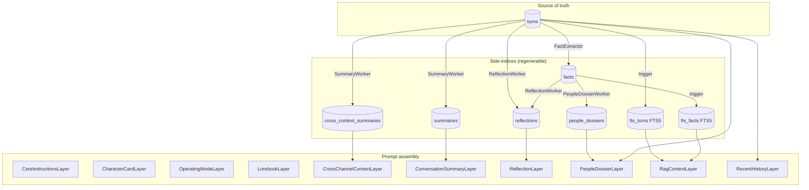

# Context pipeline

How a user turn becomes a system-prompt sent to the LLM, and how
side-indices are kept in sync with the raw source of truth.

## Source of truth vs side-indices

The `turns` table in `data/familiars/<id>/history.db` is the durable,
append-only source of truth. Every derived artifact — summaries, FTS
index, cross-channel briefings — lives in the same SQLite database but
is **regenerable from `turns` alone**. Deleting any side-index row (or
the whole table) is safe; the next worker tick rebuilds it.



## Layers

Each layer implements a narrow Protocol:

```python
class Layer(Protocol):
    name: str
    async def build(self, ctx: AssemblyContext) -> str: ...
    def invalidation_key(self, ctx: AssemblyContext) -> str: ...
```

`build` returns the layer's text contribution (empty string opts out).
`invalidation_key` is a short string; the `Assembler` memoises
`build` results keyed on `(layer.name, invalidation_key)`. Two
`assemble` calls with the same context re-run `build` only for layers
whose key has changed.

### Static, file-sourced

| Layer | Source | Invalidation |
|---|---|---|
| `CoreInstructionsLayer` | `data/familiars/_default/core_instructions.md` | BLAKE2b content hash — catches sub-second edits |
| `CharacterCardLayer` | `data/familiars/<id>/character.md` (optional sidecar) | BLAKE2b content hash |
| `OperatingModeLayer` | in-memory `modes` dict, keyed on `viewer_mode` | `viewer_mode` |
| `LorebookLayer` | `data/familiars/<id>/lorebook.toml` (optional) | file content hash + matched entry indices |

### Dynamic

| Layer | Source | Invalidation |
|---|---|---|
| `ConversationSummaryLayer` | `summaries` table | `ch<id>:wm<last_summarised_id>` |
| `CrossChannelContextLayer` | `cross_context_summaries` table, per-viewer map | `<source>:wm<source_last_id>` concatenated |
| `PeopleDossierLayer` | `people_dossiers` table, candidate set from recent authors + `turn_mentions` | `t<latest_id>:cap<n>:<key>:f<last_fact_id>` concatenated |
| `ReflectionLayer` | `reflections` table, channel-scoped (channel-agnostic rows always surface) | `ch<id>:r<latest_reflection_id>:cap<n>` |
| `RagContextLayer` | `fts_turns` + `fts_facts` FTS5 search | `(current_cue, latest_fts_id, latest_fact_id)` |
| `RecentHistoryLayer` | `turns.recent(channel_id, window_size)` | not cached — it *is* the query |

The `recent_history` layer does not contribute to the system prompt.
It populates the `recent_history` list on `AssembledPrompt`, which
the responder appends as `Message` objects.

## Watermark-driven workers

### `SummaryWorker`

Runs as a background task on a `tick_interval_s` (default 5s). Per
tick:

1. **Per-channel rolling summary** — for each channel with turns,
   compare `latest_id` to `summaries.last_summarised_id`. If the gap
   is `>= turns_threshold` (default 10), build a prompt with
   `(prior summary, new turns since watermark)`, call `LLMClient.chat`,
   write the result to `summaries`.
2. **Cross-channel summary** — for each `(viewer_channel, source)`
   pair in `cross_channel_map`, compare `source.latest_id` to
   `cross_context_summaries.source_last_id`. If the gap is `>= cross_k`
   (default 5), build a briefing-style prompt with
   `(prior summary, new turns in source)` and write to
   `cross_context_summaries`.

Both strategies compound: new summaries are built on top of prior
ones rather than recomputed from raw turns each time. This keeps
token cost bounded; a periodic full recompute (every *M* compounding
cycles) is reserved for a later refinement once drift data shows
it's needed.

### FTS5 triggers

`fts_turns` is a contentless FTS5 virtual table over `turns.content`,
kept in sync by SQLite triggers:

- `turns_ai_fts` — after insert on `turns`, insert into `fts_turns`.
- `turns_ad_fts` — after delete, remove.
- `turns_au_fts` — after update, delete+insert.

No worker loop; writes are synchronous with `HistoryStore.append_turn`.
`HistoryStore.rebuild_fts()` drops and repopulates the index from
`turns` — useful if triggers ever desync.

`fts_facts` mirrors the pattern over `facts.text` with
`facts_ai_fts` / `facts_ad_fts` triggers. Only insert + delete are
needed — fact `text` is never rewritten in place (supersession adds
a new row and marks the old one stale; see [Fact discipline](#fact-discipline-supersession-and-self-capability)
below).

### `FactExtractor`

Watermark-driven off `memory_writer_watermark`. Every
`tick_interval_s` (default 15 s), `turns_since_watermark(limit=batch_size)`
returns up to `batch_size` un-processed turns; if fewer than
`batch_size` are available the tick is a no-op (wait for more).
Otherwise a single LLM call extracts a JSON list of
`{text, source_turn_ids}` facts, which are persisted with provenance
pointing back to the originating turn ids. The watermark advances to
the last processed turn id **whether or not** extraction produced
any facts — otherwise a malformed response would stall the worker on
the same batch forever.

A post-extraction filter drops self-capability "facts" (e.g.,
`I cannot remember names`, `the assistant has no internet access`)
before they hit the store. See [Fact discipline](#fact-discipline-supersession-and-self-capability)
for the rationale.

### `PeopleDossierWorker`

Compounds per-person summaries off the facts watermark. Same shape as
`SummaryWorker` (compound prior + new evidence with one LLM call) but
keyed by `canonical_key` instead of `channel_id`. Cadence is
intentionally a quarter of `SummaryWorker`'s tick (`tick_interval_s = 20 s`):
people-level evidence churns slower than turn-by-turn summaries, and
the read path (`PeopleDossierLayer`) is a cheap SQLite lookup that
doesn't wait on the worker.

Per tick:

1. `subjects_with_facts(familiar_id)` returns
   `{canonical_key: max(facts.id)}` across non-superseded facts whose
   `subjects_json` lists each key.
2. For each subject, compare against its `people_dossiers.last_fact_id`
   watermark. Skip when nothing is new.
3. `facts_for_subject(canonical_key, min_id_exclusive=watermark)`
   pulls the new evidence; the worker feeds prior dossier + new facts
   to the LLM and writes the result back with the updated watermark.

Empty LLM replies are dropped — a blank response must not blow away
an existing dossier. Subjects whose only facts are superseded
disappear from the candidate set; the dossier row stays put.

### `ReflectionWorker`

Writes higher-order syntheses over recent turns + facts (M3). Ticks
every `tick_interval_s` (default 60 s) — slower than
`PeopleDossierWorker` because reflections are themes and patterns,
not turn-by-turn updates.

Per tick:

1. Read `latest_id(turns)` for the familiar; compare to the newest
   reflection row's `last_turn_id` watermark. Skip if the gap is
   `< turns_threshold` (default 20).
2. Pull turns since the watermark plus the most recent N facts (for
   evidence the reflection can cite even when the turns themselves
   don't surface them).
3. Ask the background-tier LLM for at most `max_reflections_per_tick`
   (default 3) reflections, each with `cited_turn_ids` /
   `cited_fact_ids`.
4. Persist each row that cites at least one valid id; drop rows
   that hallucinate everything. The row's `last_turn_id` /
   `last_fact_id` columns snapshot the worker's view at write time
   — also serve as the next tick's watermark, no separate watermark
   table.

`ReflectionLayer` reads recent rows on assemble and renders citation
breadcrumbs `[T#42, F#7]`. Rows that cite at least one superseded
fact are flagged `(stale)`; the row itself is never deleted.

## Fact discipline: supersession and self-capability

The facts store holds **observations about the world**, with
provenance back to the source turns. Two policies keep it from
silently rotting:

### No self-capability statements

A "fact" like *the assistant cannot remember names or faces* is a
self-description, not an observation — it expires the instant the
underlying capability changes (e.g., once entity resolution lands).
Such statements belong in the system prompt or in a runtime-computed
self-description, not in a persistent facts table where they'd
silently mislead the model long after they stopped being true.

The `FactExtractor` handles this in two layers:

1. **Prompt-side**: the extractor's system message explicitly
   instructs the LLM not to emit facts about itself, the assistant,
   or its own limitations.
2. **Post-filter**: `_is_self_capability(text)` matches a small set
   of first-person and "the assistant/AI/model" patterns at the
   start of the fact. Matched facts are dropped (logged at DEBUG)
   before `append_fact`. This is belt-and-braces — even if the
   model ignores the prompt instruction, the row never lands.

### Supersession instead of overwrite

For facts that legitimately go stale (people change jobs,
preferences shift, contradictions emerge): replace the old fact with
a new one and mark the old row `superseded_at = now`,
`superseded_by = <new_id>`. The old row stays in the table.

- `recent_facts` and `search_facts` default to `WHERE superseded_at
  IS NULL` — reads see "what's currently true".
- Pass `include_superseded=True` for audit, contradiction
  inspection, or future provenance UIs.
- `supersede_fact(old_id, new_id)` is the only write API; it
  refuses to re-supersede an already-superseded row (signals an
  upstream bug rather than absorbing it silently).

The `fts_facts` index covers all rows including superseded ones
(the FTS triggers don't filter); read paths apply the
`superseded_at IS NULL` filter via the JOIN to `facts`. Keeping
superseded text indexed means re-superseding (e.g., reverting an
incorrect supersession via a new fact) doesn't require an FTS
rebuild.

Cache invalidation: `latest_fact_id` counts all rows including
superseded ones, so the `RagContextLayer` cache key flips whenever
a new fact is appended — and supersession-by-replacement always
appends, so the key naturally moves. (A future "manual supersede
without replacement" path would need to track supersession state in
the key directly; not built today.)

### Subject metadata: surviving nickname rot

Display names appear verbatim in fact text ("Cass likes pho"), but
Discord and Twitch users can rebrand freely. Without an out-of-band
link to a stable identifier, every fact about a renamed user becomes
referentially orphaned — FTS keeps matching the stale name, and the
model has no way to know the new nickname is the same person.

The fix is a soft annotation on each fact: an optional
`subjects_json` column storing
`[{canonical_key, display_at_write}]` for each person the
extractor identified. `Author.canonical_key`
(`platform:user_id`) is stable across renames; `display_at_write`
is the name the LLM saw when the fact was authored.

**Write path.** `FactExtractor` builds a participants manifest
(`canonical_key → current display name`) from two sources, batch-first:
the authors of the current batch (with per-turn `guild_id` for
label resolution), then `recent_distinct_authors` per channel
touched by the batch — capped at `participants_max` (default 30).
The widening matters because a batch where only one user speaks
otherwise forecloses on linking other names in the turn text;
including recent prior speakers lets the LLM resolve "what about
Aria?" to her canonical key even when she didn't speak in this
batch. Cap keeps prompt size bounded.

The manifest is injected into the LLM prompt alongside the turns
themselves. The LLM is asked to optionally tag each fact with
`subject_keys` — a list of canonical keys from the manifest. The
extractor validates
those keys against the manifest (unknowns are dropped silently),
pairs each with the current display name, and persists them via
`HistoryStore.append_fact(subjects=...)`.

**Read path.** `RagContextLayer` renders fact text verbatim and
appends a soft annotation when any subject's current display name
differs from `display_at_write`:

> `- Cass likes pho. (Cass is now known as peeks)`

Resolution goes through `HistoryStore.resolve_label(canonical_key,
guild_id)`, which prefers per-guild nick → global_name → username →
turn snapshot → user_id. If the canonical key resolves to the bare
user_id (nothing else found) or matches `display_at_write`, no
annotation is added.

**Why annotation, not substitution.** Identity consolidation is
provisional. Mic-sharing on Discord, relayed quotes ("Bob says
hi"), and plain ambiguity all break a clean 1:1 mapping from a
mentioned name to a canonical key. Treating the extractor's hint
as authoritative and rewriting fact text would launder a guess
into source-of-truth. Appending `(was: …; now: …)` keeps the
original observation intact and makes the link visible as a hint.

**Forward-only.** Existing facts have `subjects_json = NULL` and
render unchanged. The doc/code flow expects readers to live with
the unannotated tail; backfilling is theoretically possible (walk
each fact's `source_turn_ids`, pull the originating Author) but
not worth the migration code for a bounded dev-test corpus.

## People dossiers

The dossier feature combines the prompt-layer pattern with the
summary-caching pattern: per-person summaries are compounded off the
facts watermark by `PeopleDossierWorker` and stitched into the
system prompt by `PeopleDossierLayer`. The two halves are decoupled
through the `people_dossiers` table, so the read path stays a
cheap SQLite lookup and the LLM-driven refresh stays off the hot
path.

### Storage

```
people_dossiers (
    familiar_id    TEXT NOT NULL,
    canonical_key  TEXT NOT NULL,
    last_fact_id   INTEGER NOT NULL,
    dossier_text   TEXT NOT NULL,
    created_at     TEXT NOT NULL,
    PRIMARY KEY (familiar_id, canonical_key)
)
```

One row per person. `last_fact_id` is the watermark over `facts.id`
that the worker has already folded into `dossier_text` —
`PeopleDossierWorker` skips refresh when nothing in `facts` has
moved past it. Same shape as `summaries`.

### Layer (read path)

`PeopleDossierLayer` walks the active channel's last `window_size`
turns newest-first. For each turn it appends the author's
`canonical_key` and any `turn_mentions` rows to an ordered candidate
list, deduping on first sight (so most-recent occurrence wins).
The list is truncated to `max_people` — same hard-count budgeting
style as `RecentHistoryLayer.window_size`. Candidates without a
stored dossier are skipped silently; the worker fills them in
within one tick.

The render is one Markdown block:

```
## People in this conversation

### Cass
@cass_login · she/her
Bio: Lover of pho.

Cass enjoys pho. Lives in Toronto.

### Aria
@aria_codes
Bio: Runs a bakery on Queen St.

Aria runs a bakery on Queen St.
```

Display names come from `HistoryStore.resolve_label`, so per-guild
nicknames win over snapshot labels — symmetric with the rest of
the read path. The optional second line carries `@username` and
profile pronouns (omitted when missing); the `Bio:` line is capped
at 240 characters to keep the header lightweight. Profile fields
flow in via `Author.from_discord_member` (read defensively via
`getattr` — pronouns/bio aren't always populated on bot tokens) and
are persisted by `HistoryStore.upsert_account`. `accounts.pronouns`
and `accounts.bio` columns are added by an idempotent migration on
existing DBs.

Cache invalidation key: `t<latest_id>:cap<n>:<key>:f<wm>,…`. New
turns flip `latest_id` (changing the candidate set); a worker
refresh flips `f<wm>` for that key.

### Why a separate worker

Folding dossier refresh into `FactExtractor` would couple two
unrelated cadences (extracting new facts vs compounding per-person
summaries) and double the LLM cost on every batch. Splitting them
keeps each worker's prompt narrowly scoped, lets the dossier worker
tick on its own clock (4× slower), and preserves the existing
single-responsibility shape of the worker family.

## Discord identity, replies, and mentions

A Discord account exposes four name fields — `id`, `username`,
`global_name`, per-guild `nick` — plus message-level relations
(`reference` for replies, `mentions` for pings). The pipeline
navigates all of them so the bot can both *understand* who's
speaking to whom and *act* by threading replies and pinging users
deliberately.

### Identity model

Two new tables sit alongside the existing `turns` snapshot:

- `accounts(canonical_key PK, platform, user_id, username,
  global_name, pronouns, bio, last_seen_at)` — stable per-account
  row, last-write wins on identity columns; profile columns
  (`pronouns`, `bio`) preserve the prior non-NULL value via
  `COALESCE` so a profile-less re-observation doesn't clobber an
  earlier richer one. One row per `(platform, user_id)`.
- `account_guild_nicks(canonical_key, guild_id, nick, last_seen_at)`
  — per-guild override, primary-keyed by both columns. NULL `nick`
  is meaningful: "we observed them with no override".

`turns.author_*` columns stay as a self-contained snapshot — they
are the historical receipt of what the bot saw at write time. The
`accounts` tables are the live identity cache. `resolve_label`
walks them in preference order:

1. `account_guild_nicks.nick` for the active `(canonical_key,
   guild_id)`
2. `accounts.global_name`
3. `accounts.username`
4. The latest turn's `Author.label` (snapshot fallback for
   pre-feature rows)
5. The bare `user_id` portion of `canonical_key`

This means the read path always shows the freshest per-guild
display name even when the snapshot baked into older turns is
stale.

### Replies (read + write)

Each turn carries two new `TEXT` columns: `platform_message_id`
(the Discord snowflake) and `reply_to_message_id` (the parent
snowflake when `discord.Message.reference` was set). A
`(familiar_id, platform_message_id)` index makes parent lookup
O(1).

- **Read.** `RecentHistoryLayer` resolves each turn's
  `reply_to_message_id` through
  `HistoryStore.lookup_turn_by_platform_message_id`. Render depth is
  adaptive: when the parent is already inside the same recent-
  history window, the child gets a short marker plus a ≤80-char
  snippet (`[14:32 Alice ↩ Bob: parent…] child`) — the full parent
  is about to render anyway. When the parent is *outside* the
  window, the child carries the full parent content (capped at
  ~400 chars) so the reply stays intelligible without the reader
  having to scroll. Unknown parent ids drop the marker silently.
- **Write — opt-in.** `bot.send_text` accepts an optional
  `reply_to_message_id`; when set, the post threads via
  `discord.MessageReference(message_id=…, fail_if_not_exists=False)`.
  Threading is *not* the default: a normal reply just posts.
  `TextResponder` only threads when the LLM deliberately asks for
  it by emitting a `[↩]` (or `[reply]`) marker anywhere in its
  output. The marker is stripped before sending; presence flips
  the `reply_to_message_id` argument from `None` to the inbound
  message id. This is the abilility the bot reaches for in busy
  channels where it isn't obvious which message it's responding
  to. The returned platform message id is stored on the assistant
  turn so future user replies *to* the bot can be linked back.

### Mentions (read + write)

A `turn_mentions(turn_id, canonical_key)` junction table records
who is salient in each turn. Two writers populate it:

- **Discord pings** — on intake, `bot.on_message` reads
  `message.mentions`, the source publishes them as `Author` objects
  in the event payload, and `TextResponder` upserts each one into
  `accounts` (keeping the identity cache fresh) and inserts the
  `turn_mentions` rows.
- **Fact-extractor subjects** — when `FactExtractor` resolves a
  fact's `subject_keys` against the participants manifest, it
  mirrors the canonical keys into `turn_mentions` for each of the
  fact's `source_turn_ids`. This bridges bare-text references
  ("what about Aria?") that never raised a Discord ping but that
  the LLM successfully linked to a known canonical key. Inserts
  are PK-deduped, so a turn that was both pinged and fact-extracted
  ends up with the union of keys.

Downstream, `PeopleDossierLayer` reads `mentions_for_turn` and
treats every recorded canonical key as a candidate for dossier
inclusion — the layer doesn't care which writer added the row.

In rendered prompts, Discord's raw `<@USER_ID>` markers in turn
content are rewritten to `[@DisplayName]` via `resolve_label` —
symmetric with the form the LLM is asked to *emit* on output.

### Bot-emitted pings

A short, channel-agnostic addendum is appended to the system prompt
on every text reply:

```
## Output controls

- Ping a user by writing `[@DisplayName]` using a name that
  appears in recent messages. Unrecognised names render as
  plain text without pinging.
- Optionally prefix your message with `[↩]` to thread it as a
  reply to the message you're responding to. …
- To reply to a *specific* earlier message, write
  `[↩ <message_id>]` using the `#<id>` shown next to that message
  in recent history. Unknown ids fall back to the triggering
  message id.
```

`RecentHistoryLayer` surfaces `platform_message_id` next to each
turn's speaker (`[14:32 Alice #1234567890] hi`) when present, so
the model can target a specific earlier message via
`[↩ 1234567890]`. The marker parser captures the optional id and
`TextResponder` validates it against
`HistoryStore.lookup_turn_by_platform_message_id`; unknown ids
silently degrade to threading on the inbound message.

### Final reminder

Every system prompt closes with a small block restating *current
time* (`YYYY-MM-DD H:MMpm UTC`) and the literal sentinels the
responder honours. The block is rebuilt per-call (cheap), so the
model never sees a stale clock — useful when the prompt cache lives
across long-tailed turns. Voice channels see only `<silent>`; text
channels also list `[@DisplayName]` and `[↩ <message_id>]`. Source:
`src/familiar_connect/context/final_reminder.py`.

Both responders also append a *second* copy of the same block as a
trailing `system` message, after recent history, with
`include_mode_instruction=True`. This appends the per-mode
operating directive (`"You are speaking aloud. Keep replies short
(one or two sentences). Avoid markdown."` for voice; the
text-channel equivalent for text) to the tail copy. The directive
is also still set up-front by `OperatingModeLayer` — the trailing
copy is recency insurance: long contexts make models drift away
from format gates buried at the top of the system prompt, and a
final-position reminder is the cheapest fix.

There is **no per-channel enumeration** of pingable users. The LLM
grounds on the names already visible in recent history (where
`<@USER_ID>` markers were rewritten to `[@DisplayName]` on intake);
the responder then tries to resolve whatever the model emits.
Resolution uses a `label → canonical_key` map built from
`recent_distinct_authors` + `resolve_label` — enough to pin the
right user when guild nicknames keep names unambiguous, and to
silently drop anything else.

Known markers become `<@user_id>` and contribute to
`AllowedMentions(users=…)`. Unknown markers degrade to plain
`@DisplayName` (no ping). `send_text` always passes
`discord.AllowedMentions(everyone=False, roles=False, users=[…])`
restricted to the resolved ids — even if the LLM smuggles a raw
`<@123>` for someone outside the active set, Discord will not
deliver the notification.

Ambiguous labels (two participants sharing a display name in the
same channel) keep first-write and log a warning. Guild nicknames
usually keep this from happening; the AllowedMentions guard makes
any misping recoverable.

### What we deliberately don't do

- No `@everyone` / role-mention support on the bot's output side.
  Discord's bot/role permissions are the gate.
- No mention-of-bot / addressivity heuristics. The decision of
  *when* the bot speaks is unchanged by this work; only *how*.
- No backfill of legacy turns or facts. Legacy rows just don't
  participate in reply lookups (orphan markers drop silently) and
  fall back to their `author_*` snapshot for label resolution.

## RAG retrieval quality

`RagContextLayer` runs the inbound user turn through SQLite FTS5
against `fts_turns` and `fts_facts`. Two policies keep recall
acceptable on free-text chat cues:

- **OR-joined tokens with stopword filtering.** FTS5's default
  match operator is implicit-AND — every token in the cue must
  appear in the indexed row, which destroys recall on multi-word
  chat cues ("hey, do you know about cat toys?" almost never
  matches a 6-word fact). `_tokenize_fts_query` drops common English
  stopwords; `_build_fts_match` OR-joins the rest. BM25 ranks on
  whichever substantive tokens hit. See `src/familiar_connect/history/store.py`.
- **Recent-window exclusion.** The user turn that *seeded* the cue
  is, by construction, the highest-BM25 match against itself — and
  it's already shown verbatim by `RecentHistoryLayer`. RAG passes
  `max_id = latest_in_channel - recent_window_size` to
  `search_turns`, scoping retrieval to turns *older* than the
  recent-history window. `recent_window_size` is wired in
  `commands/run.py` to the same value as `RecentHistoryLayer`.

Both policies surface in the `RagContextLayer`'s constructor
parameters (`recent_window_size` defaulting to 0 for tests / callers
that don't opt in; the production wiring sets it).

**Rendering.** Retrieved hits are no longer flat ``- [Alice] text``
lines — each hit pulls ``id ± context_window`` neighbours from the
same channel (default 1, dropping any neighbour the recent-history
window already shows) and the result is grouped by UTC date:

```
## Possibly relevant earlier turns

2026-05-03:
> [2:29PM Peebo]: i can't understand what you guys are saying
> [2:30PM Peebo]: my brain's dying
> [2:33PM Cassidy]: Dude maybe you should take a break
```

Date headers, 12-hour clock, and the surrounding turns make each
hit interpretable on its own — the model doesn't have to guess at
when or in what tone the line landed.

Open work the current retrieval doesn't address:

- **Embeddings** would beat keyword matching on semantic recall (e.g.,
  cue "What did Aria order at lunch?" → fact "Aria likes pho"). Out
  of scope for the present pipeline.
- **Cue extraction** — using the raw user turn as the cue is noisy.
  Pulling named entities or topic words out of the turn first would
  improve precision without embeddings.

## Expiry semantics for cross-channel summaries

Cross-channel summaries can go stale in two ways:

1. **Turn-count watermark** — source channel has gained `cross_k`
   turns since the last cached summary. `SummaryWorker` regenerates.
2. **Wall-clock TTL** — summary is older than `ttl_seconds`
   (default 600 s) at assembly time. `CrossChannelContextLayer`
   **suppresses** the stale summary in its `build` output (layer opts
   out); the summary row stays in SQLite and is replaced on the next
   worker tick.

The TTL is enforced on the *read* path so a long-idle familiar doesn't
leak stale cross-channel content into a fresh prompt while the worker
hasn't ticked. The watermark is enforced on the *write* path so the
worker doesn't wake up and rebuild summaries that haven't meaningfully
changed.

## Cold-cache signals (research-phase)

`familiar_connect.diagnostics.cold_cache` provides three detectors:

- `detect_topic_shift` — Jaccard overlap between the new turn's
  content words and the rolling summary; fires below 0.15.
- `detect_unknown_proper_noun` — capitalized tokens (3+ chars) in
  the new turn that don't appear in prior context.
- `detect_silence_gap` — wall-clock gap above `threshold_seconds`
  (default 300 s).

`log_signals()` runs all three and emits one `ColdCache` log line per
firing signal. **Phase-3 behaviour is instrumentation only** — no
cache is invalidated on a signal. After collecting a corpus of
(signal-fired, retrieval-failed) pairs, the most-predictive signals
will be wired to force rebuilds of the stale layers. See plan
§ Context point 3 for the rationale.

## Single-writer pattern

Each responder owns user-turn writes for its own topic. `TextResponder`
appends the user turn (from a `discord.text` event) before calling
`Assembler.assemble`, and `VoiceResponder` does the same for voice
finals. Single-writer-in-the-same-task gives `RecentHistoryLayer`
read-after-write consistency: the new turn is in SQLite *before* the
LLM prompt is built, so the model always sees the message it's being
asked to respond to. A separate writer task (e.g. an earlier
`HistoryWriter` design) would race the responder and produce stale
prompts.

`HistoryWriter` (`processors/history_writer.py`) is kept in the
codebase as a reference implementation of the single-writer + dedup
pattern, but it is no longer wired into the run loop.

## Multi-party addressivity

Every channel the familiar joins is multi-party — humans talk to each
other, not just to the bot. Two pieces collaborate to handle "is this
turn for me?" without a separate gating LLM call:

1. **Message format carries speaker + time.** `RecentHistoryLayer`
   renders user turns as `[HH:MM Display Name] content` (UTC).
   Different speakers get different prefixes; the rhythm of timestamps
   tells the model whether a conversation is flowing between humans.
2. **Silent sentinel in the reply.** The system prompt instructs the
   model to emit the literal token `<silent>` as its *entire* reply
   when the latest message is not for it. `SilentDetector`
   (`familiar_connect.silence`) inspects the streaming reply
   delta-by-delta; on a prefix match it short-circuits the stream,
   the responder skips Discord posting / TTS, and no assistant turn
   is appended. The user turn is still recorded — observation is not
   gated by response.

The sentinel is best-effort: it relies on the model following the
system-prompt instruction. A stray `<silent>` mid-reply is treated as
content (prefix-only match); the decision latches once made and
subsequent deltas don't re-open it.

## Data flow per user turn

```
Discord text on channel C
  → DiscordTextSource publishes discord.text
  → TextResponder:
      appends user turn to `turns` (fts_turns trigger fires; row indexed)
      seeds RagContextLayer cue = content
      Assembler.assemble(ctx, viewer_mode="text")
      LLMClient.chat_stream (cancellable via scope; SilentDetector watches deltas)
      if `<silent>` detected: bail (no send, no assistant turn)
      else: BotHandle.send_text(channel_id, reply); append assistant turn
      router.end_turn(scope)

Voice transcript final on channel C (voice:C)
  → VoiceSource publishes voice.transcript.final
  → VoiceResponder:
      logs cold-cache signals (prior summary vs new text, silence gap)
      appends user turn directly
      seeds RagContextLayer cue = text
      Assembler.assemble(ctx)
        → cached CoreInstructions / CharacterCard / OperatingMode
        → CrossChannelContextLayer: TTL-checked read from cross_context_summaries
        → ConversationSummaryLayer: read from summaries
        → PeopleDossierLayer: read from people_dossiers, capped at max_people
        → RagContextLayer: FTS search on cue
        → RecentHistoryLayer: last N turns for channel C
      LLMClient.chat_stream (cancellable via scope; SilentDetector watches deltas)
      if `<silent>` detected: bail (no TTS, no assistant turn)
      else: TTSPlayer.speak; append assistant turn

Background: SummaryWorker tick (every 5 s)
  → for each channel: maybe regenerate rolling summary
  → for each viewer×source: maybe regenerate cross-channel summary

Background: PeopleDossierWorker tick (every 20 s)
  → subjects_with_facts(familiar_id) → {canonical_key: max_fact_id}
  → for each subject whose watermark moved: compound prior dossier + new facts
```

## Configuration

Per-channel overrides in `character.toml` (`[channels.<id>]`):

- `history_window_size` — overrides the tier default
  (`voice_window_size` / `text_window_size`) for this channel's
  `RecentHistoryLayer`.
- `prompt_layers` — explicit ordered list of layer names (parsed; the
  full wiring of per-channel reordering arrives alongside richer layer
  stacks).
- `message_rendering` — `"prefixed"` (keep `[HH:MM display_name]` in
  content) or `"name_only"` (rely on OpenAI `name` field).

`SummaryWorker` honours:

- `turns_threshold` (default 10) — new turns before rolling summary
  regenerates.
- `cross_k` (default 5) — new turns in source channel before
  cross-channel summary regenerates.
- `cross_channel_map: dict[int, list[int]]` — per-viewer source list.
- `tick_interval_s` (default 5) — seconds between ticks.

`CrossChannelContextLayer` honours:

- `ttl_seconds` (default 600) — read-side staleness threshold.
- `viewer_map` — mirrors `cross_channel_map` on the worker side.

`PeopleDossierWorker` honours:

- `tick_interval_s` (default 20) — seconds between ticks (¼ of
  `SummaryWorker`'s default).

`PeopleDossierLayer` honours:

- `window_size` (default 20) — how far back into the channel to
  look when collecting candidate canonical keys (authors + mentions).
- `max_people` (default 8) — hard cap on dossiers rendered per
  prompt; oldest mentions drop first when the candidate set exceeds
  the cap.
