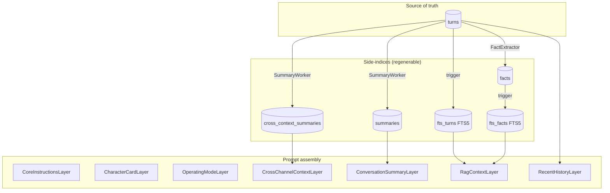

# Context pipeline

How a user turn becomes a system-prompt sent to the LLM, and how
side-indices are kept in sync with the raw source of truth.

## Source of truth vs side-indices

The `turns` table in `data/familiars/<id>/history.db` is the durable,
append-only source of truth. Every derived artifact — summaries, FTS
index, cross-channel briefings — lives in the same SQLite database but
is **regenerable from `turns` alone**. Deleting any side-index row (or
the whole table) is safe; the next worker tick rebuilds it.



## Layers

Each layer implements a narrow Protocol:

```python
class Layer(Protocol):
    name: str
    async def build(self, ctx: AssemblyContext) -> str: ...
    def invalidation_key(self, ctx: AssemblyContext) -> str: ...
```

`build` returns the layer's text contribution (empty string opts out).
`invalidation_key` is a short string; the `Assembler` memoises
`build` results keyed on `(layer.name, invalidation_key)`. Two
`assemble` calls with the same context re-run `build` only for layers
whose key has changed.

### Static, file-sourced

| Layer | Source | Invalidation |
|---|---|---|
| `CoreInstructionsLayer` | `data/familiars/_default/core_instructions.md` | BLAKE2b content hash — catches sub-second edits |
| `CharacterCardLayer` | `data/familiars/<id>/character.md` (optional sidecar) | BLAKE2b content hash |
| `OperatingModeLayer` | in-memory `modes` dict, keyed on `viewer_mode` | `viewer_mode` |

### Dynamic

| Layer | Source | Invalidation |
|---|---|---|
| `ConversationSummaryLayer` | `summaries` table | `ch<id>:wm<last_summarised_id>` |
| `CrossChannelContextLayer` | `cross_context_summaries` table, per-viewer map | `<source>:wm<source_last_id>` concatenated |
| `RagContextLayer` | `fts_turns` + `fts_facts` FTS5 search | `(current_cue, latest_fts_id, latest_fact_id)` |
| `RecentHistoryLayer` | `turns.recent(channel_id, window_size)` | not cached — it *is* the query |

The `recent_history` layer does not contribute to the system prompt.
It populates the `recent_history` list on `AssembledPrompt`, which
the responder appends as `Message` objects.

## Watermark-driven workers

### `SummaryWorker`

Runs as a background task on a `tick_interval_s` (default 5s). Per
tick:

1. **Per-channel rolling summary** — for each channel with turns,
   compare `latest_id` to `summaries.last_summarised_id`. If the gap
   is `>= turns_threshold` (default 10), build a prompt with
   `(prior summary, new turns since watermark)`, call `LLMClient.chat`,
   write the result to `summaries`.
2. **Cross-channel summary** — for each `(viewer_channel, source)`
   pair in `cross_channel_map`, compare `source.latest_id` to
   `cross_context_summaries.source_last_id`. If the gap is `>= cross_k`
   (default 5), build a briefing-style prompt with
   `(prior summary, new turns in source)` and write to
   `cross_context_summaries`.

Both strategies compound: new summaries are built on top of prior
ones rather than recomputed from raw turns each time. This keeps
token cost bounded; a periodic full recompute (every *M* compounding
cycles) is reserved for a later refinement once drift data shows
it's needed.

### FTS5 triggers

`fts_turns` is a contentless FTS5 virtual table over `turns.content`,
kept in sync by SQLite triggers:

- `turns_ai_fts` — after insert on `turns`, insert into `fts_turns`.
- `turns_ad_fts` — after delete, remove.
- `turns_au_fts` — after update, delete+insert.

No worker loop; writes are synchronous with `HistoryStore.append_turn`.
`HistoryStore.rebuild_fts()` drops and repopulates the index from
`turns` — useful if triggers ever desync.

`fts_facts` mirrors the pattern over `facts.text` with
`facts_ai_fts` / `facts_ad_fts` triggers. Only insert + delete are
needed; fact rows aren't updated in place.

### `FactExtractor`

Watermark-driven off `memory_writer_watermark`. Every
`tick_interval_s` (default 15 s), `turns_since_watermark(limit=batch_size)`
returns up to `batch_size` un-processed turns; if fewer than
`batch_size` are available the tick is a no-op (wait for more).
Otherwise a single LLM call extracts a JSON list of
`{text, source_turn_ids}` facts, which are persisted with provenance
pointing back to the originating turn ids. The watermark advances to
the last processed turn id **whether or not** extraction produced
any facts — otherwise a malformed response would stall the worker on
the same batch forever.

## Expiry semantics for cross-channel summaries

Cross-channel summaries can go stale in two ways:

1. **Turn-count watermark** — source channel has gained `cross_k`
   turns since the last cached summary. `SummaryWorker` regenerates.
2. **Wall-clock TTL** — summary is older than `ttl_seconds`
   (default 600 s) at assembly time. `CrossChannelContextLayer`
   **suppresses** the stale summary in its `build` output (layer opts
   out); the summary row stays in SQLite and is replaced on the next
   worker tick.

The TTL is enforced on the *read* path so a long-idle familiar doesn't
leak stale cross-channel content into a fresh prompt while the worker
hasn't ticked. The watermark is enforced on the *write* path so the
worker doesn't wake up and rebuild summaries that haven't meaningfully
changed.

## Cold-cache signals (research-phase)

`familiar_connect.diagnostics.cold_cache` provides three detectors:

- `detect_topic_shift` — Jaccard overlap between the new turn's
  content words and the rolling summary; fires below 0.15.
- `detect_unknown_proper_noun` — capitalized tokens (3+ chars) in
  the new turn that don't appear in prior context.
- `detect_silence_gap` — wall-clock gap above `threshold_seconds`
  (default 300 s).

`log_signals()` runs all three and emits one `ColdCache` log line per
firing signal. **Phase-3 behaviour is instrumentation only** — no
cache is invalidated on a signal. After collecting a corpus of
(signal-fired, retrieval-failed) pairs, the most-predictive signals
will be wired to force rebuilds of the stale layers. See plan
§ Context point 3 for the rationale.

## Single-writer pattern

`HistoryWriter` is the sole task that calls
`HistoryStore.append_turn()` for `discord.text` user turns arriving
on the bus. It dedups incoming events by `event_id` to tolerate
future bus-level retries; ignores events for other familiars. Both
`TextResponder` and `VoiceResponder` write their own assistant turns
directly (they need sequential consistency with `RecentHistoryLayer`
reads in the same task); the voice responder additionally writes its
user turn directly because the upstream `VoiceSource` does not flow
through `HistoryWriter`. Those write paths can migrate to the writer
via a publish-confirm topic in a later phase if SQLite contention
becomes measurable.

## Data flow per user turn

```
Discord text on channel C
  → DiscordTextSource publishes discord.text
  → HistoryWriter appends user turn to `turns`
  → fts_turns trigger fires; row indexed
  → TextResponder assembles prompt (viewer_mode="text"), streams LLM,
    posts via BotHandle.send_text, appends assistant turn

Voice transcript final on channel C (voice:C)
  → VoiceSource publishes voice.transcript.final
  → VoiceResponder:
      logs cold-cache signals (prior summary vs new text, silence gap)
      appends user turn directly
      seeds RagContextLayer cue = text
      Assembler.assemble(ctx)
        → cached CoreInstructions / CharacterCard / OperatingMode
        → CrossChannelContextLayer: TTL-checked read from cross_context_summaries
        → ConversationSummaryLayer: read from summaries
        → RagContextLayer: FTS search on cue
        → RecentHistoryLayer: last N turns for channel C
      LLMClient.chat_stream (cancellable via scope)
      TTSPlayer.speak
      append assistant turn

Background: SummaryWorker tick (every 5 s)
  → for each channel: maybe regenerate rolling summary
  → for each viewer×source: maybe regenerate cross-channel summary
```

## Configuration

Per-channel overrides in `character.toml` (`[channels.<id>]`):

- `history_window_size` — overrides the global default for this
  channel's `RecentHistoryLayer`.
- `prompt_layers` — explicit ordered list of layer names (parsed; the
  full wiring of per-channel reordering arrives alongside richer layer
  stacks).
- `message_rendering` — `"prefixed"` (keep `[display_name]` in
  content) or `"name_only"` (rely on OpenAI `name` field).

`SummaryWorker` honours:

- `turns_threshold` (default 10) — new turns before rolling summary
  regenerates.
- `cross_k` (default 5) — new turns in source channel before
  cross-channel summary regenerates.
- `cross_channel_map: dict[int, list[int]]` — per-viewer source list.
- `tick_interval_s` (default 5) — seconds between ticks.

`CrossChannelContextLayer` honours:

- `ttl_seconds` (default 600) — read-side staleness threshold.
- `viewer_map` — mirrors `cross_channel_map` on the worker side.
