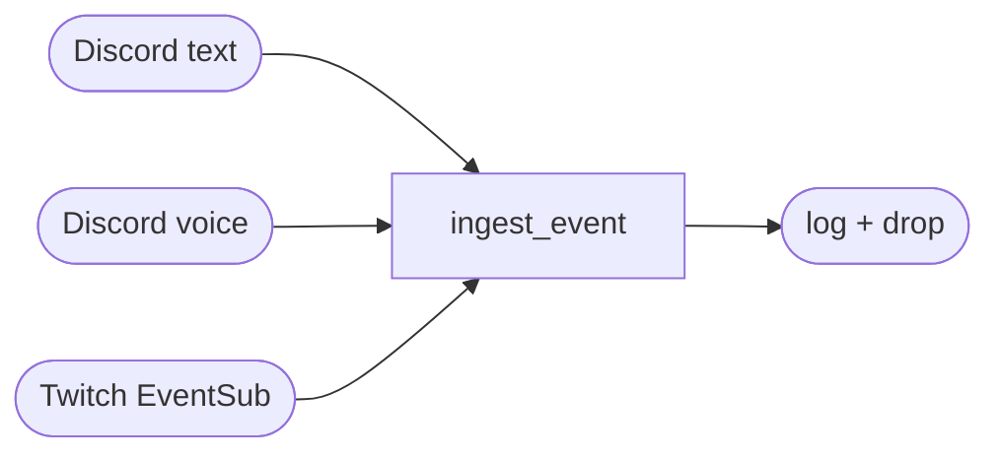

# Architecture overview

A Discord bot shell with two-way plumbing for text and voice, plus a
Twitch EventSub client. All incoming events (text messages, voice
utterances, Twitch events) land in `ingest_event` in `bot.py`, which
logs and drops them.

## Components

- **CLI** — `familiar-connect run --familiar <id>` (argparse, subcommand dispatch).
- **Configuration** — TOML with deep-merge over `data/familiars/_default/character.toml`. See [Configuration model](configuration-model.md).
- **Discord text** — `on_message` event handler + `subscribe-text` / `unsubscribe-text` slash commands. Built on py-cord.
- **Discord voice** — `subscribe-voice` / `unsubscribe-voice` slash commands join a voice channel with `DaveVoiceClient` (DAVE E2E encryption).
- **Transcription** — Deepgram streaming client. Instantiated on startup; not called.
- **TTS** — Azure / Cartesia / Gemini clients behind a uniform `TTSResult` shape. Instantiated on startup; not called.
- **OpenRouter LLM client** — `LLMClient` with a per-slot table (just `main_prose`).
- **SQLite history store** — `data/familiars/<id>/history.db`.
- **Subscription registry** — `data/familiars/<id>/subscriptions.toml`, written by the subscribe/unsubscribe slash commands.
- **Twitch EventSub** — client code present; event callback funnels into `ingest_event`.
