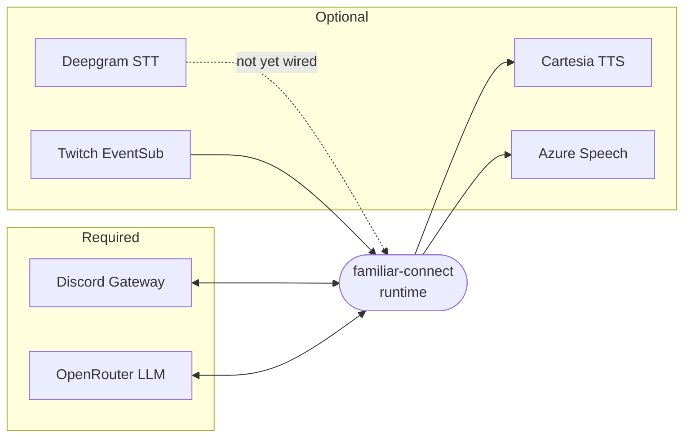

# Architecture overview

An AI familiar that joins Discord voice channels, listens, understands
speech, and talks back using real AI voices.

## Goals

- **Single runtime.** The entire backend runs as one Python process
  using `asyncio`. No separate worker scripts, no external message
  broker.
- **Unified entry point.** One `familiar-connect run` starts
  everything — Discord gateway, voice capture, transcription, LLM,
  TTS, and Twitch listener all run as concurrent tasks under a single
  `asyncio.TaskGroup`.
- **Local-first.** The context layer makes no calls to third-party
  state stores. All context state lives in-process, in the filesystem
  next to the bot, or in the bot's own SQLite. The only network calls
  in the context layer are to the LLM endpoints we're already using
  for generation.
- **Single operator, one active familiar per process.**
  Familiar-Connect is run by a single admin on their own machine —
  there is no multi-user / multi-tenant ambition. Multiple character
  folders may coexist under `data/familiars/`, but exactly one is
  active at a time. See
  [Configuration model](configuration-model.md) for the detailed
  ownership rules.

## Target architecture

All components run as coroutines within a single `asyncio` event
loop, scoped by `asyncio.TaskGroup` for structured concurrency and
clean cancellation (Python 3.13+):

```mermaid
flowchart TB
    dv([Discord voice channel]) --> cap[Audio capture]
    cap --> aq[(asyncio.Queue&#58; PCM)]
    aq --> stt[Transcription<br/>Deepgram streaming]
    stt --> tq[(asyncio.Queue&#58; text)]
    tw([Twitch EventSub]) --> tq
    tq --> cm[ConversationMonitor<br/>chattiness &amp; interjection]
    cm --> cp[Context pipeline]
    cp --> or[OpenRouter<br/>streaming completion]
    or --> tts[TTS<br/>Cartesia / Azure]
    tts --> oq[(asyncio.Queue&#58; audio)]
    oq --> dvp([Discord voice playback])

    classDef queue fill:#eee,stroke:#888,stroke-dasharray:3 3;
    class aq,tq,oq queue;
```

Every box runs under one root `asyncio.TaskGroup` — a crash anywhere
cancels the whole reply path.

Development uses red/green TDD throughout.

## External services

The runtime talks to five outside services. Two are required; the rest
are optional and the bot degrades gracefully without them.

- **Discord Gateway** (required) — `DISCORD_BOT`. The bot has nothing
  to listen to or speak into without it.
- **OpenRouter** (required) — `OPENROUTER_API_KEY`. The reply
  generation call. Model selectable per-familiar.
- **Cartesia / Azure Speech** (optional) — TTS providers. Without
  either, the bot still replies in text channels it is subscribed to.
- **Deepgram** (optional, not yet wired) — streaming STT for voice
  input. See the
  [Voice input roadmap entry](../roadmap/voice-input.md).
- **Twitch EventSub** (optional) — only needed if a familiar uses the
  Twitch commentary features in the
  [Twitch guide](../guides/twitch.md).

See [Installation](../getting-started/installation.md) for the exact
env-var names, the minimal "just text replies" configuration, and how
to turn each optional service on.

## Core components

### Discord bot
Built with **py-cord**. Voice send/receive uses **davey** to handle
Discord's DAVE (Audio/Video E2E Encryption) protocol. The subscription
surface and channel-mode slash commands are documented in
[Slash commands](../getting-started/slash-commands.md).

### Transcription

**Primary: Deepgram (Nova-2, streaming)**

- Native WebSocket streaming API, ~300ms latency, strong accuracy
- Handles raw PCM streams directly — maps well to Discord's audio
  pipeline
- Good Python SDK (`deepgram-sdk`)

**Fallback: faster-whisper (local)**

- Zero cost, no rate limits, no external dependency
- Requires a GPU for real-time performance
- Good offline / privacy-preserving option

Pipeline: Discord 48kHz Opus → decode to PCM → resample to 16kHz →
stream to Deepgram WebSocket (or feed chunks to faster-whisper).

!!! warning "STT not yet wired into the reply path"
    The transcription and voice-pipeline modules exist, but incoming
    voice audio is not yet fed into the context pipeline. See
    [Voice input](../roadmap/voice-input.md) for the roadmap entry.

### AI response (OpenRouter)

The LLM call is the core of the bot's reply path. Its inputs — system
prompt, retrieved knowledge, conversation history, per-user notes —
are assembled by the [Context pipeline](context-pipeline.md), *not*
inline in the bot loop. The LLM client (`familiar_connect.llm`) only
speaks to OpenRouter; it is deliberately unaware of where its messages
came from so the pipeline can be tested and extended in isolation.

- **Provider:** OpenRouter. Model selection is per-call-site and per
  familiar — set individually in `character.toml` under
  `[llm.main_prose]`, `[llm.post_process_style]`,
  `[llm.reasoning_context]`, `[llm.history_summary]`,
  `[llm.memory_search]`, and `[llm.interjection_decision]`.
- **Streaming:** Responses are streamed so the TTS path can start
  speaking before the full reply arrives.
- **Per-call-site slots:** Each provider/processor holds its own
  `LLMClient` drawn from the slot it owns, so a familiar can pin a
  cheap model (e.g. `openai/gpt-4o-mini`) on the cheap slots while
  still using a heavyweight model on `main_prose`. The process-wide
  rate-limit semaphore is shared across every slot.

### Context pipeline

Everything upstream of the OpenRouter call — character cards, system
prompt assembly, memory retrieval, conversation history, and the
cheap side calls each call site makes from its own `LLMClient` slot
— is assembled by a single **context pipeline** that runs as a
scoped `asyncio.TaskGroup` on every reply. The pipeline is the
architectural backbone for all "AI behaviour knobs" in the bot.

See [Context pipeline](context-pipeline.md) for the full design and
step-by-step implementation history, and [Memory](memory.md) for the
on-disk memory directory the pipeline reads and writes.

### Text-to-speech

**Primary: Cartesia Sonic**

- Purpose-built for real-time conversational AI
- Sub-100ms time-to-first-byte — best-in-class latency
- Native WebSocket streaming, quality rivalling ElevenLabs at lower
  cost
- Outputs 44.1kHz PCM natively
- Voice cloning support

**Secondary: Azure Speech (Neural)**

- Keep the 9 original Azure voices for nostalgia
- Mature Python SDK, good fallback if Cartesia has downtime

**Budget fallback: Fish Audio**

- Generous free tier for development/testing
- Community voice models for variety

Pipeline: LLM text → stream to Cartesia/Azure WebSocket → receive PCM
audio → resample to 48kHz Opus → feed to Discord voice playback.

### Twitch integration

Connects to Twitch EventSub WebSocket as a task in the root
`asyncio.TaskGroup`. See the [Twitch guide](../guides/twitch.md) for
the event catalogue and slash command surface.

### Monitoring dashboard

**Starlette + Hypercorn** (asyncio-native web dashboard):

- Hypercorn runs on asyncio and mounts as a task in the bot's root
  `asyncio.TaskGroup`
- Routes:
    - `/health` — JSON status of each service (Discord, Twitch,
      transcription, TTS, LLM)
    - `/events` — Recent event log via SSE or WebSocket
    - `/context` — Per-turn, per-provider latency and token metrics
      from the context pipeline, so provider/processor enable/disable
      decisions can be made from real measurements

!!! warning "Dashboard not yet shipped"
    The `PipelineOutput.outcomes` data is already captured per turn
    and `bot.py` logs a structured line per outcome; the web
    dashboard itself is a separate work item. See the
    [Context pipeline](context-pipeline.md) page for the full list
    of deferred items.

## Resilience

**Third-party service calls.** Service clients (`LLMClient`,
`CartesiaTTSClient`, the Deepgram transcriber) raise on failure;
callers decide the fallback. Every `except` clause on a service
call enumerates its exception types — either directly (e.g.
`(httpx.HTTPError, ValueError, KeyError)` for `LLMClient.chat`)
or via a Protocol-declared type (e.g. `PreProcessorError` for
pre-processors). No catch-all `except Exception:` is used on new
code; contract violations surface loudly.

- **Main reply failure (`bot.py`).** The main-prose `LLMClient.chat`
  call in both the text and voice reply paths catches the closed
  raise set `(httpx.HTTPError, ValueError, KeyError)`, logs a
  warning, and returns silently. No apology text, no reaction, no
  history write for the failed turn — the user sees nothing and
  can simply retry. `LLMClient`'s own 120 s httpx timeout is the
  ceiling; no extra `asyncio.timeout` wrapper is added because the
  main reply is the one call for which a long wait is preferable
  to a fallback.
- **LLM retry policy.** `LLMClient` retries only on HTTP 429 with
  exponential backoff (honouring `Retry-After` when present, up
  to `_MAX_DELAY_S`). Every other failure — transport error,
  non-2xx response, malformed payload — is the caller's
  responsibility.
- **TTS failure.** `CartesiaTTSClient.synthesize` raises on every
  non-2xx response and on any transport error. The `bot.py` call
  sites swallow TTS exceptions with `_logger.exception` so a
  missing voice clip never blocks a text reply. The client itself
  has no retry logic.
- **Context pipeline pre-processors.** The pre-processor loop in
  `ContextPipeline.assemble` catches the Protocol-declared
  `PreProcessorError` only, logs a warning, and passes the last
  successful request on to the next stage. Any other exception
  escaping `PreProcessor.process` is a contract violation and
  propagates out of the pipeline — this is intentional so bugs
  surface loudly rather than being silently hidden.
- **Context pipeline providers and post-processors.** Providers
  run under a scoped `asyncio.TaskGroup` with per-provider
  deadlines; misses are recorded as `"timeout"` / `"error"`
  outcomes. Post-processors are each wrapped in a pass-through
  `try/except` so a failing cleanup pass degrades to a no-op for
  just that stage.

## Persistence

- Raw transcripts of every conversation are stored verbatim in
  SQLite (`familiar_connect.history.store.HistoryStore`).
- The [memory directory](memory.md) contains the distilled,
  human-readable form of everything the familiar "knows." It is the
  *model's* view of the world.
- Derived artefacts — rolling summaries, future vector indices, tag
  caches — are rebuildable from the raw transcript store and the
  memory directory. Losing them is annoying but not destructive.
- Original imported character cards are kept verbatim alongside the
  unpacked `self/` files (`memory/self/.original.png`), so a future
  change to the unpacking logic can re-run against the originals.
