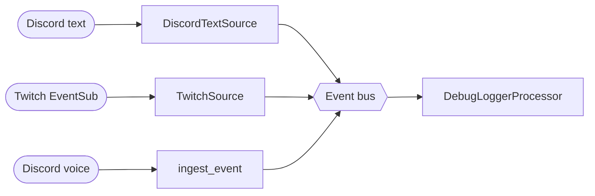

# Architecture overview

A Discord bot shell with two-way plumbing for text and voice, plus a
Twitch EventSub client. Incoming events flow through an in-process
**event bus** to subscribed **processors**. Phase 1 ships the bus,
sources, and a debug logger processor only — user-visible behaviour is
unchanged (events land, the debug processor logs them).

## Components

- **CLI** — `familiar-connect run --familiar <id>` (argparse, subcommand dispatch).
- **Configuration** — TOML with deep-merge over `data/familiars/_default/character.toml`. See [Configuration model](configuration-model.md).
- **Event bus** — in-process, topic-keyed fan-out. `InProcessEventBus` implements the `EventBus` Protocol. Per-topic `BackpressurePolicy` (`BLOCK`, `DROP_OLDEST`, `DROP_NEWEST`, `UNBOUNDED`). Lifecycle: `starting → running → draining → stopped`.
- **Turn router** — `TurnRouter.begin_turn(session_id, turn_id)` cancels any prior `TurnScope` in the same session before registering the new one; different sessions are independent.
- **Stream sources** — publish onto the bus.
  - `DiscordTextSource` — called from `on_message`; publishes `discord.text`.
  - `TwitchSource` — drains the `TwitchWatcher` queue; publishes `twitch.event`.
  - Voice / Deepgram source arrives in Phase 2.
- **Processors** — subscribe to topics, optionally republish.
  - `DebugLoggerProcessor` — Phase-1 "something is on the bus" signal. Logs one line per event.
  - Responders, summary worker, fact extractor arrive in later phases.
- **Diagnostics** — `@span(name)` decorator in `familiar_connect.diagnostics.spans` emits timing logs (`span=<name> ms=<n> status=<ok|error>`). Logs-first aggregation; a metrics collector + `/diagnostics` slash command come in Phase 5.
- **Discord text** — `on_message` event handler + `subscribe-text` / `unsubscribe-text` slash commands. Built on py-cord.
- **Discord voice** — `subscribe-voice` / `unsubscribe-voice` slash commands join a voice channel with `DaveVoiceClient` (DAVE E2E encryption).
- **Transcription** — Deepgram streaming client. Instantiated on startup; not yet wired to the bus.
- **TTS** — Azure / Cartesia / Gemini clients behind a uniform `TTSResult` shape. Instantiated on startup; not yet wired.
- **OpenRouter LLM client** — `LLMClient` with a per-slot table (just `main_prose`).
- **SQLite history store** — `data/familiars/<id>/history.db`. Raw `turns` table is the source of truth; `summaries` and `cross_context_summaries` are watermarked side-indices.
- **Subscription registry** — `data/familiars/<id>/subscriptions.toml`, written by the subscribe/unsubscribe slash commands.
- **Twitch EventSub** — client code present; its queue is drained by `TwitchSource` onto the bus.

## Topics

Topic strings live in `familiar_connect.bus.topics`:

| Topic | Payload | Backpressure default |
|---|---|---|
| `discord.text` | channel, guild, `Author`, content | unbounded |
| `discord.voice.state` | member, channel | unbounded |
| `voice.audio.raw` | PCM chunk + speaker | drop-oldest |
| `voice.transcript.partial` | text + turn_id | block |
| `voice.transcript.final` | text + turn_id + author | block |
| `voice.activity.start` / `.end` | speaker | block |
| `twitch.event` | `TwitchEvent` | unbounded |
| `llm.response.chunk` / `.final` | text delta / message | block |
| `tts.audio.chunk` / `.final` | audio bytes + word timestamps | block |
