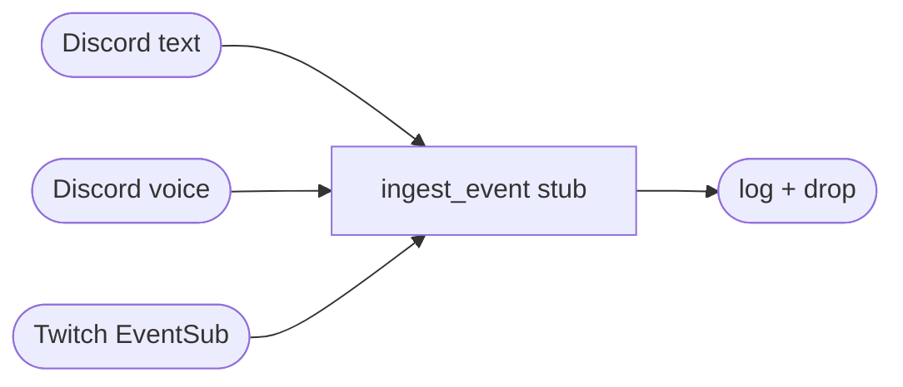

# Architecture overview

!!! warning "Demolition in progress"
    The re-arch branch (`claude/re-arch-*`) has removed the reply
    orchestration layer. What follows describes the minimal shell
    that still boots. The next reply-path design will fill back
    in from here.

## What's here

A Discord bot shell with two-way plumbing for text and voice, plus a
Twitch EventSub client. All incoming events (text messages, voice
utterances, Twitch events) land in `ingest_event` in `bot.py` — a
symmetric log-and-drop stub — reserving one seam for the future
unified event-stream abstraction.

## Kept from the prototype

- **CLI** — `familiar-connect run --familiar <id>` (argparse, subcommand dispatch).
- **Configuration** — TOML with deep-merge over `data/familiars/_default/character.toml`. See [Configuration model](configuration-model.md).
- **Discord text** — `on_message` event handler + `subscribe-text` / `unsubscribe-text` slash commands. Built on py-cord.
- **Discord voice** — `subscribe-voice` / `unsubscribe-voice` slash commands join a voice channel with `DaveVoiceClient` (DAVE E2E encryption), capture audio into `RecordingSink`.
- **Transcription** — Deepgram (streaming) + faster-whisper (local) clients. Instantiated on startup; not called from the reply path (the reply path is a stub).
- **TTS** — Azure / Cartesia / Gemini clients behind a uniform `TTSResult` shape. Same story: built, not called yet.
- **OpenRouter LLM client** — `LLMClient` with a per-slot table (just `main_prose` right now).
- **SQLite history store** — `data/familiars/<id>/history.db`. Schema preserved so prior conversations still read back.
- **Subscription registry** — `data/familiars/<id>/subscriptions.toml`, written by the subscribe/unsubscribe slash commands.
- **Twitch EventSub** — client code present; event callback funnels into `ingest_event` stub.

## Gone

The reply orchestration layer, in its entirety. Specifically:

- Context pipeline (providers, pre-processors, post-processors, budgeter, layers).
- Memory directory (`memory/self`, `memory/lore`, `memory/facts`, embedding index, content search).
- Character card import (SillyTavern V3 PNG/JSON).
- Multi-stage LLM pattern (stepped-thinking pre, recast post, history summary, memory writer, mood evaluator, interjection decision).
- Voice interruption FSM (`ResponseState` × `InterruptionClass` dispatch matrix).
- Text interjection FSM (`ConversationMonitor`, shrinking-interval lull timer).
- Typing simulation.
- Channel modes (`full_rp`, `text_conversation_rp`, `imitate_voice`) and per-mode instruction files.
- Metrics subsystem + per-turn traces + `familiar-connect metrics` CLI.

## Forward-looking seams (not yet wired)

- **Unified event-stream abstraction.** The three `ingest_event` call sites look identical on purpose — this is the hook the next reply path will replace.
- **LLM slot table.** Kept (trimmed to `main_prose`) so the cache-reuse-centric reply redesign can reintroduce slots without churn on `config.py`.
- **History store schema.** The `turns.mode` column survives as a free-form string tag so the next design can repopulate it however it wants without a migration.
