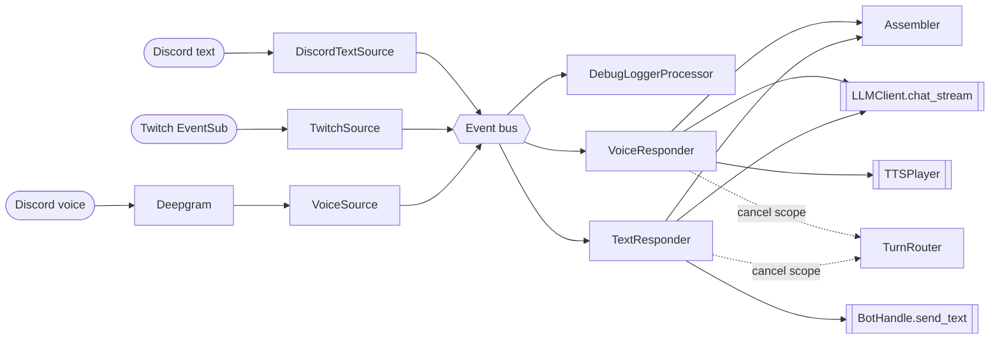

# Architecture overview

A Discord bot with two-way plumbing for text and voice, plus a Twitch
EventSub client. Incoming events flow through an in-process **event bus**
to subscribed **processors** that assemble a layered prompt, call an LLM,
and reply. Voice replies support sub-200 ms barge-in: a new utterance
cancels the previous reply's `TurnScope`, stopping the LLM stream and
flushing the TTS buffer.

Deeper dives:

- [Memory strategies](memory-strategies.md) — families, current
  implementation, swap points.
- [Activities](activities.md) — she gets up from the screen: absence
  gating, generated experiences, archive watermark.
- [Voice pipeline](voice-pipeline.md) — cascaded vs S2S,
  two-stage turn detection, sentence streaming, swap points.
- [Tuning](tuning.md) — every operator knob, one page.
- [Prompting field lessons](prompting.md) — measured findings from
  character-prompt iteration across model scales.
- [Roadmap](roadmap.md) — research-driven priorities.



## Components

- **CLI** — `familiar-connect run --familiar <id>` (`clap`, subcommand dispatch). The run loop installs cooperative `SIGINT`/`SIGTERM` handlers via `tokio::signal`: the first signal cancels the run loop's supervising token so it unwinds and runs orderly teardown (close the serenity client, stop the transcriber, shut the bus down), a second forces exit. Where Unix signal handlers are unavailable (Windows), the listener is skipped. Either way, Ctrl-C exits quietly with no traceback.
- **Configuration** — TOML with deep-merge over `data/familiars/_default/character.toml`. Per-channel overrides live under `[channels.<id>]`. See [Configuration model](configuration-model.md).
- **Event bus** — in-process, topic-keyed fan-out. `InProcessEventBus` implements the `EventBus` trait. Per-topic `BackpressurePolicy` (`BLOCK`, `DROP_OLDEST`, `DROP_NEWEST`, `UNBOUNDED`). Lifecycle: `starting → running → draining → stopped`.
- **Turn router** — `TurnRouter.begin_turn(session_id, turn_id)` cancels any prior `TurnScope` in the same session before registering the new one; different sessions stay independent.
- **Stream sources** — publish onto the bus.
  - `DiscordTextSource` — called from `on_message`; publishes `discord.text`.
  - `TwitchSource` — drains the `TwitchWatcher` queue; publishes `twitch.event`.
  - `VoiceSource` — drains the Deepgram transcription queue; publishes `voice.activity.start`, `voice.transcript.partial`, `voice.transcript.final`, `voice.activity.end`. All events in one utterance share `turn_id`.
- **Context assembly** — `Assembler` composes a layered system prompt in stability-descending order: `CharacterCardLayer` (`data/familiars/<id>/character.md` — persona plus operational essentials such as the `<silent>` token), `OperatingModeLayer` (voice-terse vs text-verbose), `ConversationSummaryLayer`, `LorebookLayer`, `PeopleDossierLayer`, `ReflectionLayer`, `RagContextLayer`, then `RecentHistoryLayer` (user/assistant messages, not system text; queries across all channels, not just the active one). See [Context pipeline](context-pipeline.md).
- **LLM** — `LLMClient` exposes `chat()` (blocking) and `chat_stream()` (async-iterator of content deltas). The streaming variant releases the process-wide rate-limit semaphore as soon as the request is accepted, so barge-in cancellation isn't starved.
- **TTSPlayer** — `speak(text, scope=...)` returns when playback finishes or the turn scope is cancelled. Production default is `DiscordVoicePlayer`, which synthesizes via the configured TTS client and pushes the resulting PCM through `voice_client.play(...)`. Without a configured TTS client, the loop falls back to `LoggingTTSPlayer`, which only logs intended speech. `MockTTSPlayer` is used in tests.
- **BotHandle** — adapter exposed to lifecycle wiring so bus-only processors can post back to Discord without holding a direct `discord.Bot` reference. Carries `send_text(channel_id, content)`, a `trigger_typing(channel_id)` async-context-manager factory that surfaces Discord's "Bot is typing…" indicator while a reply streams, a `typing_interrupt` policy seam that translates `on_typing` events into turn cancellations and bot-pingpong backoff (see [Discord text channel knobs](tuning.md#discord-text-channel-knobs)), and a `voice_runtime: dict[int, VoiceRuntime]` map populated by `/subscribe-voice`.
- **Processors** — subscribe to topics.
  - `DebugLoggerProcessor` — one log line per event on every subscribed topic.
  - `TextResponder` — consumes `discord.text` (appends the user turn directly, seeds the RAG cue, assembles prompt with `viewer_mode="text"`, streams LLM, posts via `BotHandle.send_text`, appends the assistant turn). Owning the user-turn write keeps read-after-write consistency for `RecentHistoryLayer` within the same task. A `SilentDetector` watches stream deltas; on a `<silent>` sentinel reply, the post and assistant-turn append are skipped (the user turn is still recorded). Discord's "Bot is typing…" indicator opens lazily inside the stream loop — only after `SilentDetector` rules out the sentinel — so reasoning that resolves to `<silent>` doesn't flicker the indicator. Before each reply the responder consults `TypingInterruptHandler` for any active bot-pingpong backoff window — see [Discord text channel knobs](tuning.md#discord-text-channel-knobs). See also [Multi-party addressivity](context-pipeline.md#multi-party-addressivity). When the slot has `tool_calling = true` and a `ToolRegistry` is wired, the responder runs `agentic_loop` instead of bare `chat_stream`; intermediate `assistant` (with `tool_calls`) and `role=tool` turns are persisted to history.
  - `VoiceResponder` — consumes `voice.activity.start` (cancels prior scope via the router; fires `TTSPlayer.stop`) and `voice.transcript.final` (appends user turn, assembles prompt, streams LLM, speaks). Stale finals (mismatched `turn_id`) are dropped. Silent-sentinel handling mirrors `TextResponder`: on `<silent>`, TTS is not invoked. Under tool calling, speech streams to TTS as content deltas arrive; tool execution happens only after the stream closes. An iteration returning a tool call with empty content triggers a short filler phrase (constructor-configurable `tool_filler_phrases`) before the handler runs, so the user never hears a silent gap.
  - `AlarmWaker` — consumes `alarm.fired`; republishes a synthetic `discord.text` event so the matching `TextResponder` produces a follow-up reply with content `[alarm fired: {reason}]`. Voice-origin alarms fall back to text (MVP).
- **FocusManager** — `familiar_connect::focus::FocusManager` tracks two independent attentional focus pointers (text, voice), each pointing at one subscribed channel. Focus shifts are model-decided (via the `shift_focus` tool) and applied immediately at tool-call time under per-modality lock — promoting the target channel's catch-up window (the last `catch_up_limit` staged turns she actually previews, default 20) to consumed before switching, while older staged backlog is marked **missed** (terminal, dropped from her window and rolling summary) so she can genuinely miss messages rather than silently absorb a whole backlog; direct @-mentions are always caught. Because the move is immediate, a turn that goes silent still leaves her where she went (no deferred state to leak into a later turn's reply). On startup, if no persisted pointer exists, the first text and first voice subscription are used as defaults. The manager also exposes `staged_channels()` counts so the context pipeline and `/diagnostics` can show pending unreads per channel. An **unread nudge** (`should_wake`) guards against starvation: when a backgrounded channel gets traffic, the text responder publishes a synthetic wake event — gated by `unread_nudge_enabled` (default on) and debounced via `nudge_debounce_seconds` — that earns the model one focused turn to notice the unread digest and (optionally) `shift_focus`; the nudge never moves focus itself.
- **ActivityEngine** — `familiar_connect::activities::ActivityEngine`, constructed only when `data/familiars/<id>/activities.toml` has a non-empty catalog (disabled = zero behavior change). The `start_activity` tool stages a global absence applied after the reply ships; while out, Discord presence goes idle with the activity label, non-ping messages are recorded but unanswered, and a real @ping on a `reachable` type earns one judgment turn (a real reply cuts the activity short). On return the engine generates an experience on the background slot, writes a mechanical event-fact, persists the experience as a marked system turn the fact extractor skips, archives long absences behind a per-channel watermark, and wakes the model only when pings were missed. See [Activities](activities.md).
- **Diagnostics** — the `span` timing helpers in `familiar_connect::diagnostics::spans` (`timed_sync` / `timed_async`) emit timing logs (`span=<name> ms=<n> status=<ok|error>`, DEBUG-level — shown at `-vv`) and feeds a process-wide `SpanCollector`; `/diagnostics` slash command renders the live p50/p95 table plus current focus pointers (`Focus: text=#<id> voice=#<id>`) and per-channel staged-unread counts (`Unreads: #<id> (<count>), …`). `voice_budget.VoiceBudgetRecorder` stamps four phase markers per voice turn (`stt_final` / `llm_first_token` / `tts_first_audio` / `playback_start`) and emits `voice.stt_to_ttft`, `voice.ttft_to_tts`, `voice.tts_to_playback`, `voice.total` spans into the same collector — see [voice pipeline § per-turn budget telemetry](voice-pipeline.md#per-turn-budget-telemetry). Each `LLMClient.chat_stream` call also emits `llm.ttfb.<slot>`, `llm.ttft.<slot>`, `llm.total.<slot>` spans plus a structured `[LLM call]` log line carrying input chars, model, OpenRouter-selected provider, and prompt/completion/cached token counts (when the upstream returns them via the `usage: { include: true }` flag).
- **Discord text** — `on_message` event handler plus `subscribe-text` / `unsubscribe-text` slash commands. Built on serenity.
- **Discord voice** — `subscribe-voice` / `unsubscribe-voice` slash commands join a voice channel with `DaveVoiceClient` (DAVE E2E encryption). On subscribe the bot attaches a `RecordingSink` and runs a `VoiceSource` task draining transcripts onto the bus. The audio pump dispatches per Discord user_id: the first audio chunk from a new SSRC lazily clones the configured Deepgram transcriber and opens a fresh WebSocket for that speaker, so two people talking concurrently get independent endpointing and don't slice each other's sentences. A per-user fan-in tags every result with the originating user_id before forwarding to the shared result queue. On unsubscribe the pump, source, and every per-user fan-in are cancelled, recording is stopped, and every per-user transcriber is closed.
- **Transcription** — Deepgram streaming client. The instance loaded at startup acts as a *template*: `clone()` is called once per Discord user that speaks. Diarization stays off — Discord delivers per-SSRC audio, so attribution is exact, not AI-inferred. Knobs live in `[providers.stt.deepgram]`; defaults bias toward fewer mid-sentence cuts (`endpointing_ms=500`, `utterance_end_ms=1500`, `smart_format=true`, `punctuate=true`). Config `keyterms` biases nova-3 toward project jargon; on top of those, each per-speaker clone is auto-seeded (before its WebSocket opens) with the voice channel's current members' proper nouns — display names, usernames, aliases, and per-guild nicknames — so a name one speaker utters transcribes correctly on every stream. The merged set is trimmed, letter-free/emoji-only tokens dropped, case-insensitively deduped, and capped for nova-3's practical keyterm limit. `DEEPGRAM_API_KEY` is the only secret; every other knob lives in TOML — see [Tuning § STT — Deepgram](tuning.md#stt-deepgram).
- **TTS synthesis** — Azure / Cartesia / Gemini clients behind a uniform `TTSResult` shape. `DiscordVoicePlayer` calls `synthesize(text)` and pushes the mono PCM (after stereo conversion) through songbird's voice connection. Without a configured TTS client, `LoggingTTSPlayer` is used.
- **OpenRouter LLM client** — one `LLMClient` per call-site slot. The slot config's `tool_calling` flag plumbs into `LLMClient.tool_calling_enabled`; responders gate on it before installing the tool registry and running the agentic loop. `stream_completion(messages, tools=...)` yields `LLMDelta` chunks (content + accumulated tool-call fragments + finish reason) and drives the agentic loop's streaming primitive.
- **Tool subsystem** — `familiar_connect::tools`. `ToolRegistry` indexes `Tool` definitions (JSON-Schema parameters + async handler). `agentic_loop(...)` runs streaming → tool execution → re-call until the model stops calling tools (capped at 5 iterations, 10s per handler). `AlarmScheduler` owns one `tokio` task per pending alarm sleeping until `scheduled_at`, then marks the row fired and publishes `alarm.fired`. On startup it reloads any rows left pending from the previous process; past-due rows fire immediately. Tools shipped: `set_alarm(when|delay_seconds, reason)`, `cancel_alarm(alarm_id)`, `view_image(image_id)` (text only), `shift_focus(channel_id)` (applies focus shift immediately at tool-call time, both modalities; returns target channel's recent turns so the model sees it in-turn), `silent(reasoning)` (suppress reply for current turn, both modalities), `read_channel(limit?, before_id?, around_id?)` (read-only peek into focused text channel history with paging, text only), `start_activity(activity, note?)` (defers a global absence; registered only when the activities catalog is non-empty — see [Activities](activities.md)). See [Tool calling](#tool-calling).
- **SQLite history store** — `data/familiars/<id>/history.db` (SQLite via bundled `rusqlite`). Raw `turns` table is the source of truth; `summaries`, `people_dossiers`, `facts`, `fact_embeddings`, `reflections`, and `reflection_watermark` are watermarked side-indices. The attentional stream adds three `turns` columns — `arrived_at` (immutable ingest time), `consumed_at` (`NULL` while staged), and `missed_at` (terminal "she never saw it" state set at promotion when a staged turn falls outside the catch-up window; keeps `consumed_at` `NULL` so every `consumed_at IS NOT NULL` read path excludes it) — plus two small per-familiar tables: `focus_pointers` (text/voice focus channels) and `unread_digest_watermark`. An idempotent migration backfills legacy rows (`arrived_at = consumed_at = timestamp`; `missed_at` left `NULL`) and adds the `idx_turns_consumed` index. See [Attentional stream](context-pipeline.md#attentional-stream). Full-text search lives outside the DB in tantivy indexes under `data/familiars/<id>/fts/turns/` and `fts/facts/` — tantivy is native Rust and its queries don't queue behind SQL writes, which fixed the original "FTS5 query blocks the Discord heartbeat for 10s" bug. `AsyncHistoryStore` (`history/async_store.rs`) wraps `HistoryStore` in an async facade, dispatching every call onto a `tokio::task::spawn_blocking` thread so the await never blocks a reactor worker. The store itself is a single-owner DB actor (`history/db.rs`): one OS thread owns the `rusqlite::Connection`, and every operation is a whole-operation closure submitted over an `mpsc` channel — so all SQL executes on that one thread and multi-statement operations (supersede, promotions, `append_fact`'s dedup-scan+insert) run in explicit transactions.
- **Subscription registry** — `data/familiars/<id>/subscriptions.toml`, written by the subscribe/unsubscribe slash commands.
- **Twitch EventSub** — client code present; its queue is drained by `TwitchSource` onto the bus.

## Topics

Topic strings live in `familiar_connect::bus::topics`:

| Topic | Payload | Backpressure default |
|---|---|---|
| `discord.text` | channel, guild, `Author`, content | unbounded |
| `discord.voice.state` | member, channel | unbounded |
| `voice.audio.raw` | PCM chunk + speaker | drop-oldest |
| `voice.transcript.partial` | text + turn_id + user_id | block |
| `voice.transcript.final` | text + turn_id + user_id + speaker | block |
| `voice.activity.start` / `.end` | turn_id | block |
| `twitch.event` | `TwitchEvent` | unbounded |
| `llm.response.chunk` / `.final` | text delta / message | block |
| `tts.audio.chunk` / `.final` | audio bytes + word timestamps | block |
| `alarm.fired` | alarm_id, channel_id, channel_kind, reason, scheduled_at, fired_at | unbounded |

## Voice reply loop

```
voice.activity.start  → TurnRouter.begin_turn(session, turn_id)
                         → prior scope.cancel()
                         → TTSPlayer.stop()  (flush in-flight audio)

voice.transcript.final → if scope.turn_id == event.turn_id:
                           history.append(user turn)
                           Assembler.assemble(ctx)
                           LLMClient.chat_stream(messages)
                             (bail if scope.is_cancelled())
                           TTSPlayer.speak(reply, scope=scope)
                           history.append(assistant turn)
                           router.end_turn(scope)
                           focus.end_turn()  (idle-clock bookkeeping; shifts already applied)
```

`voice.transcript.final` is spawned as a per-(session, user) `tokio` task,
so the bus dispatcher returns to the subscription loop immediately. A
subsequent `voice.activity.start` runs `prior.cancel()` while the prior
turn is still parked at an LLM or TTS await point — without the spawn,
the dispatcher would sit inside the prior `handle()` and the cancel
signal would arrive only after the old reply had played in full.

Scope keys are per `(channel_id, user_id)`. Discord delivers per-SSRC audio,
so every speaker fires their own `activity.start`; channel-level scoping
would let any speaker barge any other speaker's in-flight reply, which
isn't desired. Same-speaker self-barge still works as expected — the
player's poll loop catches `scope.is_cancelled()` and stops `vc.play()`
within one poll tick. A global `TTSPlayer.stop()` from `_on_activity_start`
would also cut a *different* user's in-flight reply (Discord exposes one
shared voice client per channel), so cancellation only flows through the
scope.

Per-user scoping means two speakers spawn independent, non-cancelling
reply pipelines. A per-channel `tokio::sync::Mutex` (`VoiceResponder::gate_for`)
serializes reply *generation* — `set_rag_cue` → assemble → stream →
assistant-turn commit run under it — so the second speaker's pipeline
assembles after the first commits, sees that reply in context, and can
resolve `<silent>` instead of producing a near-duplicate. The user turn
is appended outside the lock (observation never gated). Playback is
already serial on the shared voice client, so the wait adds no perceived
latency. See [Cross-speaker reply gate](voice-pipeline.md#cross-speaker-reply-gate).

Voice user turns are appended to history with the speaker's `Author`
resolved through `BotHandle.resolve_member(channel_id, user_id)`. The
resolver consults a voice-member side cache populated by two sources:
`on_voice_state_update` events for state changes (join/mute/move) and
a background `guild.fetch_member()` triggered when the audio pump sees
a new user_id for the first time. The side cache works around the
absence of the privileged `members` intent — without it,
`guild.get_member()` only knows users seen through other events
(messages, voice state changes) and silently returns `None` for
voice-only joiners. A cache miss records the turn anonymously rather
than blocking the audio path on a Discord fetch.

Barge-in latency budget: 200 ms from a new `voice.activity.start` to TTS
playback halted. Verified end-to-end (bus subscribe pattern) by
`familiar-connect/tests/responders_voice.rs`
(`dispatcher_unblocked_during_in_flight_final` and
`barge_in_during_speech_cuts_playback_fast`).

## Tool calling

The familiar can invoke in-process tools mid-turn — an agentic loop: stream
→ run tools → re-stream with results → repeat until the model stops calling
tools. Toggled per LLM slot via `[llm.<slot>].tool_calling = true`; shipped
slot defaults leave voice and text off and only `background` on, so
deployments opt in deliberately. When enabled, responders install the
global `ToolRegistry` and run `agentic_loop` instead of bare `chat_stream`.
The attentional-stream tools (`shift_focus`, `silent`, `read_channel`)
ride this same gate: with `tool_calling` off on the voice/text slot,
focus stays on its startup default and only the `<silent>` text
sentinel is available.

Voice has a hard ordering constraint: long silent gaps mid-utterance are
unacceptable. Three layers of defense ensure speech reaches TTS before a
tool runs:

1. **Mechanical**: `agentic_loop` is a single streaming call per iteration.
   Content deltas reach TTS as they arrive; `tool_call` deltas are buffered
   and executed only after the stream closes. No reordering required, no
   extra round-trip.
2. **Sharpened prompt**: the voice final-reminder layer appends "Always
   speak at least a brief acknowledgement before calling a tool. Never
   reply with a tool call alone." End-placed for weight on the immediate
   turn; targets the empty-content failure mode specifically.
3. **Filler backstop**: if an iteration closes with a tool call and no
   spoken content, the voice responder injects a short stock phrase
   (constructor-configured `tool_filler_phrases`) before the handler
   runs. Round-robin rotation keeps the same phrase from repeating.
   Guarantees no audible silence regardless of whether the model
   honored layer 2.

The text responder has no such constraint; intermediate iterations may post
nothing to Discord, and only the terminal text reply ships via
`BotHandle.send_text`. Intermediate assistant turns (with `tool_calls`)
and `role=tool` results still persist to history for audit and
prompt-rebuild on later turns; `RecentHistoryLayer` surfaces them as a
compact `→ name(args)` / `(tool→) ...` summary in the rebuilt prompt.

### Image viewing

`view_image` — selectively fetch and inspect images posted in Discord. The familiar calls it only when it wants to look; images don't enter context automatically.

**Flow:**
1. `on_message` scans `message.attachments`, `embed.image.url`, and regex-detected image URLs in message text.
2. For each image found, `collect_images` assigns `img_0`, `img_1`, … and injects `[image: img_N (filename)]` placeholders into the message content.
3. The `img_id → URL` map travels through the bus payload (`images` key) to `TextResponder`.
4. `TextResponder.handle` passes the map to the per-turn `ToolContext.images`.
5. The model calls `view_image(image_id="img_0")`. The handler fetches bytes, compresses to JPEG (1024 px longest edge, quality 85, 1 MB ceiling; iterates quality down by 5 until it fits), and calls the description model to get text. The base describe prompt is neutral; a familiar can append persona constraints via `[prompt].image_description_constraints` (e.g. a character not set in the present bans naming specific characters, people, franchises, or brands so it doesn't acquire modern pop-culture knowledge that would break immersion). The constraint string is bound into `view_image` at tool construction, not carried on the per-turn `ToolContext`.
6. `ImageResult` carries both the JPEG (base64) and the text description. The agentic loop serialises it per the slot's `multimodal` flag: `multimodal=true` sends an `image_url` content block in the tool-result message; `multimodal=false` sends the text description only.

**Configuration:**
- `[llm].image_description_model` — model name for vision-based description; empty = feature disabled.
- `[prompt].image_description_constraints` — per-familiar text appended to the neutral base describe prompt; empty (default) = base only.
- `[llm.<slot>].image_tools = true` — registers `view_image` in the text tool registry for that slot (independent of `tool_calling`).
- `[llm.<slot>].multimodal = true` — sends JPEG content blocks instead of text-only descriptions.

**Voice exclusion:** `view_image` is never registered in the voice tool registry.

**History persistence:** multimodal tool-result messages (list content) are projected to plain text before writing to history, so no raw image bytes enter the turn store.

### Alarm flow

```
set_alarm tool call          → AlarmScheduler.add(...)
                                  → INSERT INTO alarms (...)
                                  → tokio::spawn(sleep_then_fire)
                                ↳ returns {alarm_id, scheduled_at, ack}

(time passes)

sleep_then_fire timer         → UPDATE alarms SET fired_at = ...
                                → bus.publish(alarm.fired, ...)

AlarmWaker.handle(event)      → bus.publish(discord.text,
                                  content="[alarm fired: {reason}]")

TextResponder.handle(...)     → normal reply loop
```

Alarms persist in `data/familiars/<id>/history.db` (new `alarms` table) so
they survive restart. The scheduler reloads pending rows on `start()` and
re-schedules them; past-due rows fire immediately. Cancellation flips
`cancelled_at` and stops the in-flight sleep task; the `cancel_alarm` tool
exposes this to the model.

For voice-originated alarms, the MVP falls back to publishing the synthetic
text event with the voice channel id. Real Discord voice and text channels
have distinct ids, so production wiring needs an explicit voice-to-text
fallback channel map (out of scope for the initial cut).

## Per-channel and per-model tuning

`[channels.<id>]` overrides (`history_window_size`, `prompt_layers`,
`message_rendering`) and `[budget.model_curves]`
per-model multipliers live in
[Tuning — prompt assembly budget](tuning.md#prompt-assembly-budget).
